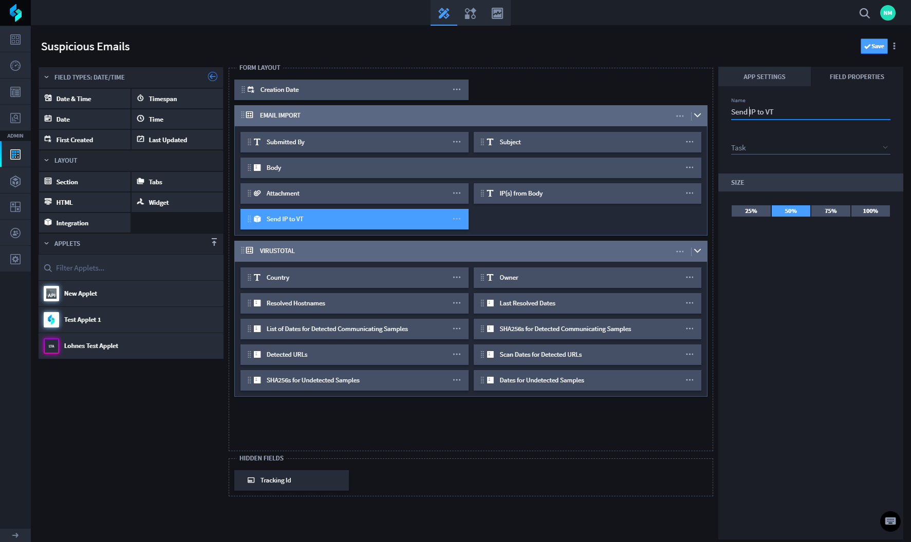
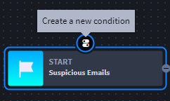
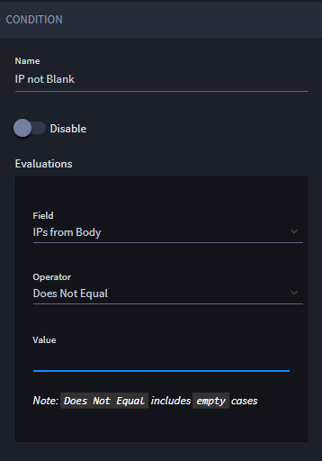
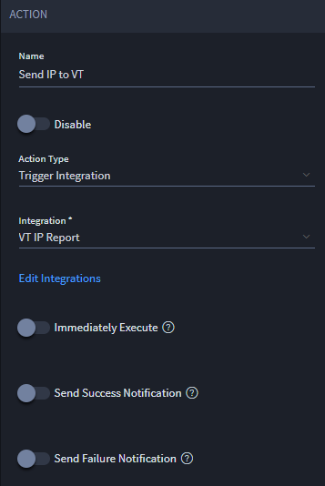

Add Automation to the Suspicious Emails Application
===================================================

Next you will add two forms of automation to your Suspicious Emails
application: a manual push button, and a workflow action.

To add automation to the Suspicious Emails application:

#. From the global navigation menu, select **Applications and Applets,**
   and then locate and open your Suspicious Emails application.

#. In Application Builder, select *Integration* from within the Layout
   Objects. Drag and Drop it to the Email Import section of the
   Application Form Layout.
   |image1|

3. Select the Integration field. In Field Settings name the button, and
   then associate it with the VirusTotal automation task you set up
   previously, *VT IP Report.
   *

3. Click **Save.**

Next, let's create another automated way to send the IP address to
VirusTotal, this time using Swimlane's workflow.

4. | From the Application Builder taskbar, click the Workflow icon.
   | |image2|

5. | Select the start of the workflow, and then click the icon for
     *Create a new condition.* Set it up with the following details:
   | |image3|

Set up the new condition with the following details:

|image4|

6. Select the new condition, and then click the icon for *Create a new
   action* and then set it up with the following details:

|image5|

7. Click **Save.**

You're ready to test the automations you've created!

Related Links
-------------

`Applications and
Applets <../../administrator-guide/applications-and-applets/applications-and-applets.htm>`__

`Integrations <../../administrator-guide/integrations/integrations.htm>`__

`Workflow <../../administrator-guide/workflow/workflow.htm>`__

