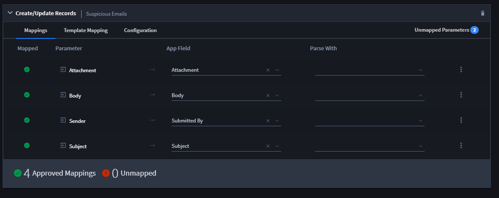

Add Parsing Detail to the Suspicious Emails Task
================================================

You have now set up a VirusTotal task to map output from VirusTotal into
your Import Suspicious Emails application. Next, you set up the parsing
detail in the Swimlane Import Suspicious Email task that will grab the
IP address from the emails that come in and input them into the IP(s)
from Body field.

To add parsing detail:

#. From the global navigation menu, select **Integrations** and then
   open the Import Suspicious Emails task.

#. On Integration/Import Suspicious Emails, click the Outputs tab and
   then expand the Create/Update Records mappings.
   |image1|

3. Update the Body parameter to map to the *IP(s) from Body* field.

4. Access the ellipsis pulldown menu for the Body parameter and select
   *Add Configuration.
   *

4. Select *Regex* from the Parse With field dropdown, and then click the
   pencil icon to access the Regex Editor.

5. Within the Regex Editor, enter the following code in the Regular
   Expression and then click **OK**:

5. Review the mappings and then click **Save.**

Related Links
-------------

`Configure Task
Input <../../administrator-guide/integrations/configure-task-input.htm#Review>`__

`Integrations <../../administrator-guide/integrations/integrations.htm>`__

`Output
Mapping <../../administrator-guide/integrations/configure-task-output/configure-task-output.htm>`__

`Create or Edit a
Task <../../administrator-guide/integrations/create-or-edit-a-task.htm>`__

