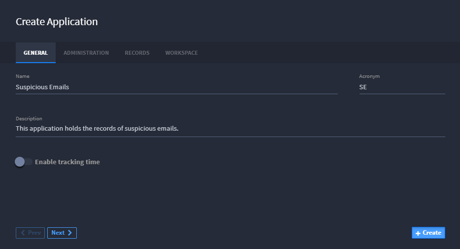
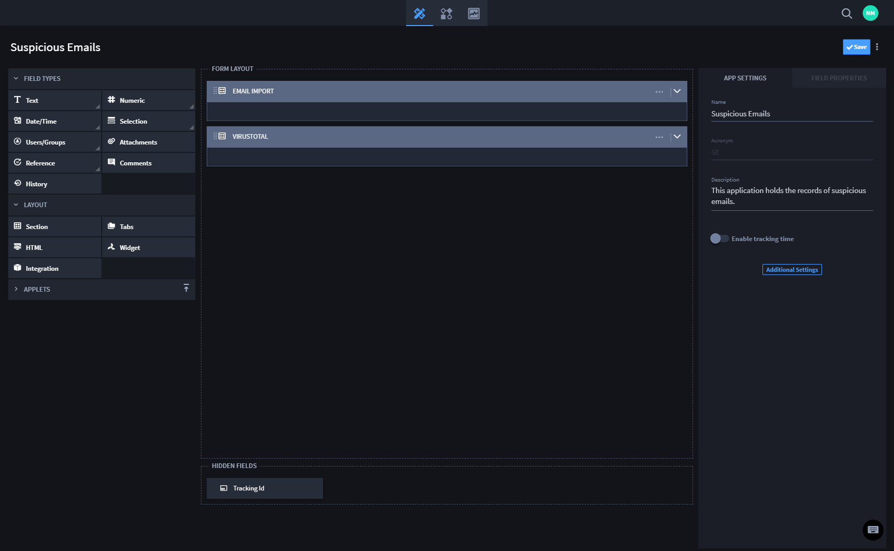
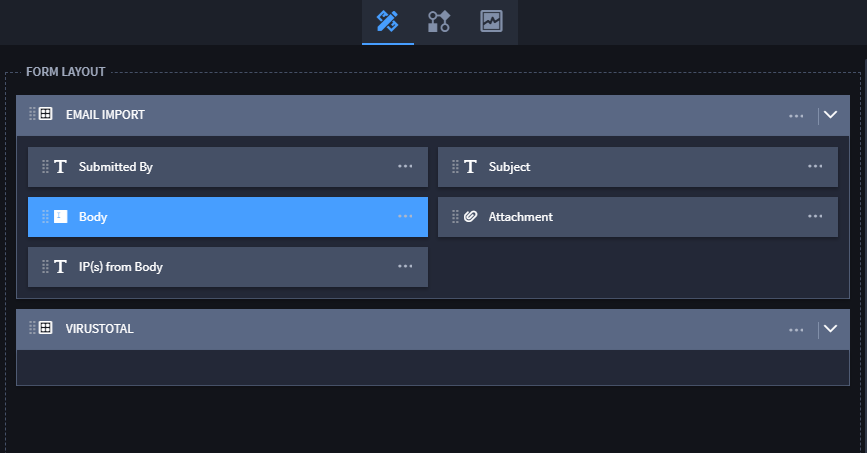
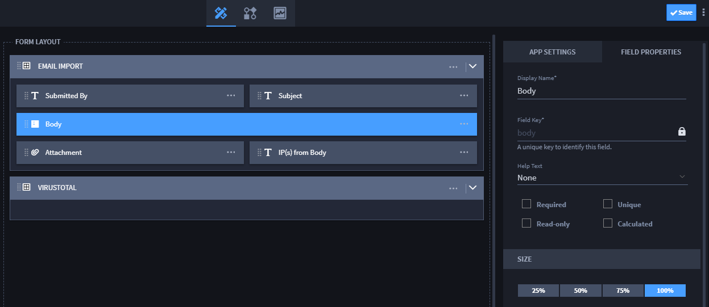

Create a Suspicious Emails Application
======================================

Now that you've created a new email asset, you are ready to create an
application that will hold all the email records that the automated
process will eventually be collecting. In this activity, you create an
application to hold records of suspicious emails.

**Note:** You could import an existing application that has all of these
details already built-in, but since you're just getting started, let's
make one from scratch.

To create a suspicious emails application:

#. From the global navigation menu, select **Applications and Applets.**

2. From the Applications and Applets home page, click the plus menu icon
   , and then select **Create a new application**.

   |image1|

3. On the Create Application, **General** tab, give your application a
   name, and (optionally) a description, and then click **Create.**

**Note:** By default, when you create a new application, a new workspace
with the name of the application is created. If you have a specific
workspace where you would like this application to reside, you can
specify it now on the Workspace tab of the Application Settings.

|image2|

Application Builder opens.

4. Drag and drop two Section Layout items to your Application Builder
   Form Layout area. Name one "Email Import" and the other "VirusTotal."

|image3|

5. | Under Field Types, drag and drop the following fields to the Email
     Import section of the Application Builder Form Layout and then give
     them the following names:

   ============== ===============
   **Field Type** Name
   ============== ===============
   Single-Line    Submitted By
   Single-Line    Subject
   Multi-Line     Body
   Single-Line    IP(s) from Body
   Attachments    n/a
   ============== ===============

   **Note:** If you do not see the fields above, click **Text** to
   expand the field type selections. Click the blue arrow to collapse
   the field type selections.

   |image4|

   **Tip:** You can change the field sizes in the Field Properties.
   Change the Multi-Line, *Body* field to 100%.

   |image5|

6. Click **Save** to save your progress so far.

   Next, you will build out the Virus Total section.

7. Add the following ten text fields to the VirusTotal section of the
   Application Builder Form Layout and rename them as indicated:

   ============== ================================================
   **Field Type** Name
   ============== ================================================
   Single-Line    Country
   Single-Line    Owner
   Multi-Line     Resolved Hostnames
   Multi-Line     Last Resolved Dates
   Multi-Line     List of Dates for Detected Communicating Samples
   Multi-Line     SHA256s for Detected Communicating Samples
   Multi-Line     Detected URLs
   Multi-Line     Scan Dates for Detected URLs
   Multi-Line     SHA256s for Undetected Samples
   Multi-Line     Dates for Undetected Samples
   ============== ================================================

8. | Add a Date and Time field to the VirusTotal section. Name the field
     *Creation Date* and, under Field Settings, set it to Read-only.
   | Additionally, on Field Settings, Advanced, change the default value
     to *Current date-time.
     *\ This field will automatically track when the record was created.

9. From the Application Builder taskbar, select **Save**.

Related Links
-------------

`Applications and
Applets <../../administrator-guide/applications-and-applets/applications-and-applets.htm>`__

`Assets <../../administrator-guide/integrations/create-or-edit-an-asset.htm>`__

.. |image1| image:: ../../Resources/Images/plus-menu-apps.png

