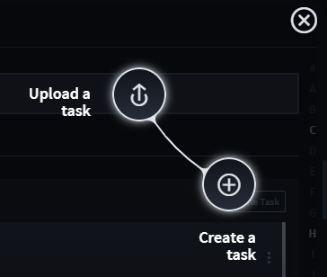
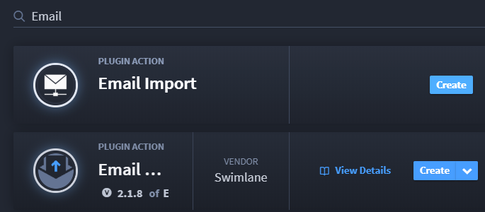
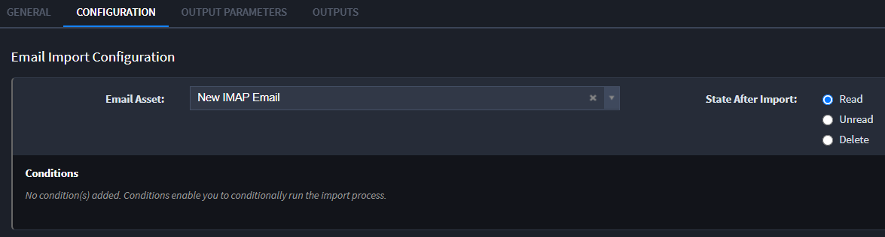
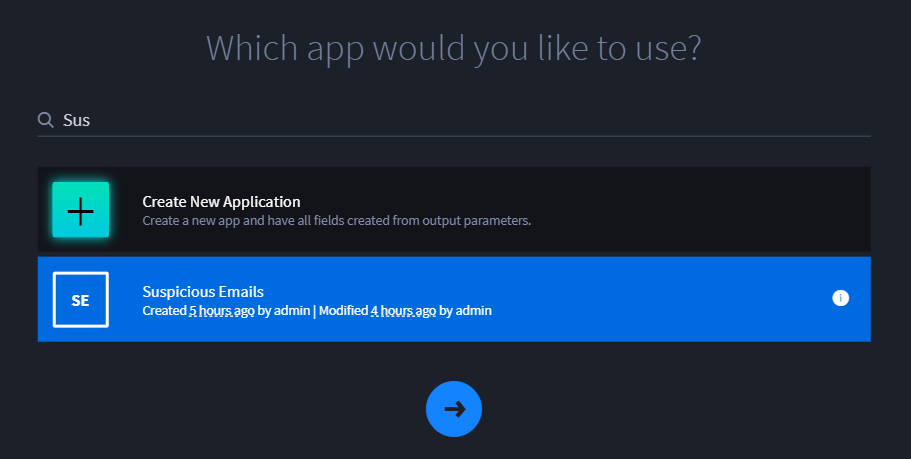
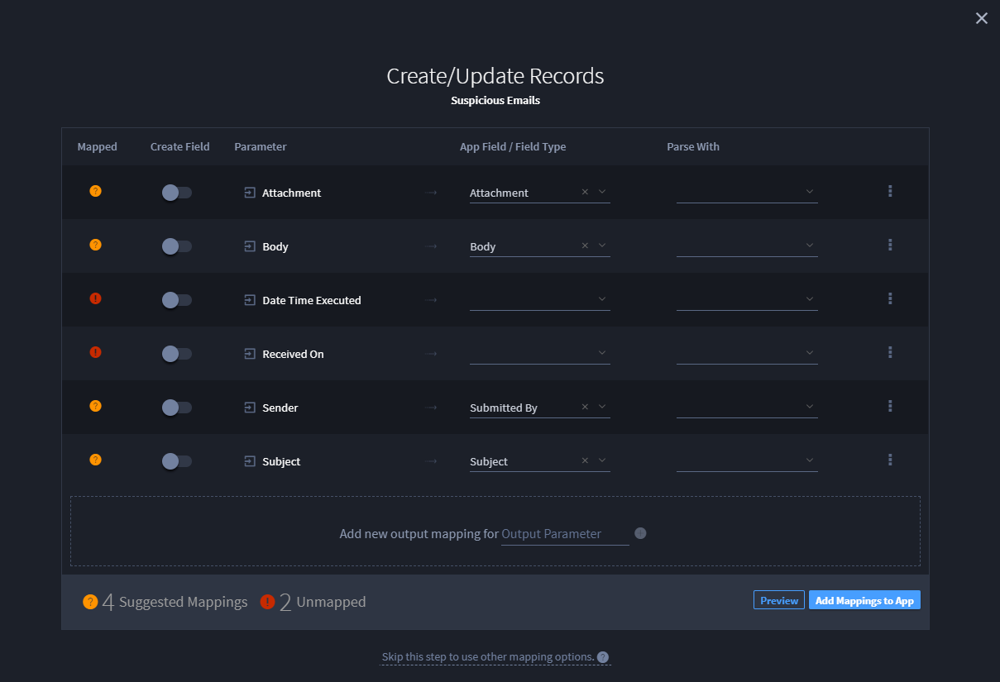
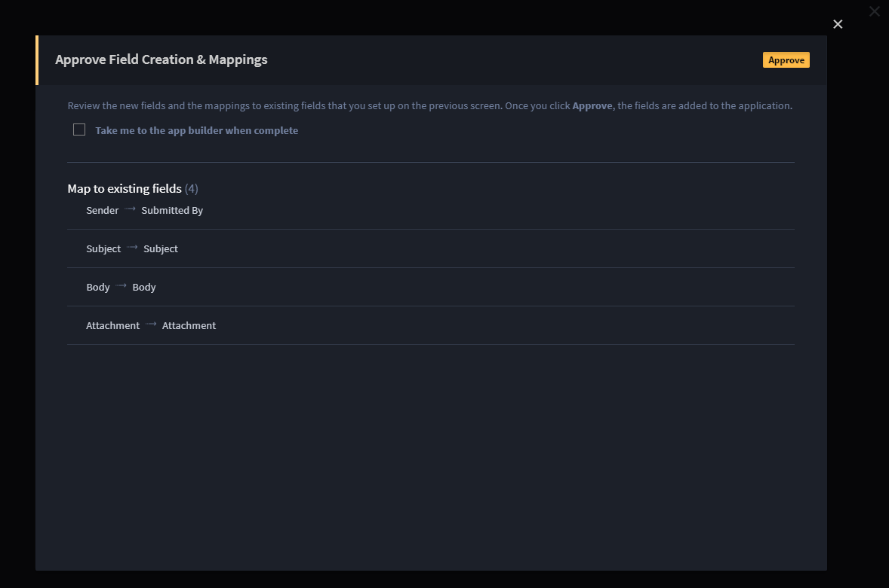

Create a Suspicious Emails Task
===============================

Now that you've created an application that will hold suspicious email
records, you are ready to create the task that prompts Swimlane to check
for suspicious emails.

To create a suspicious emails task:

#. | Access the Integrations page, then click the plus menu icon, and
     then click **Create a task**.
   | |image1|

3. | On Create a task, notice how Swimlane has grouped common task types
     by asset. Filter for Email plugin action name and then click
     **Create** on the Email Import plugin action.
   | |image2|

4. On page 2 of Create a Task, name your task. (We suggest naming it
   *Import Suspicious Emails.*) Next, from the Application drop-down
   field, select the application you just created in the previous topic,
   "Suspicious Emails," and click **Save.
   **

Clicking **Save** opens your task. From here you can begin to configure
the task and map the task outputs.

5. On Integration/Import Suspicious Emails, click the Configuration tab.

6. Under Email Import Configuration, select the IMAP Email Asset you
   created in the `Create an IMAP Email
   Asset <create-an-imap-email-asset.htm>`__ topic, and ensure that you
   have selected the **Read** checkbox to indicate the state of the
   email after the task has run.
   |image3|

7. Next, click the Outputs tab. To begin the mapping process, click
   **Create/Update Records.
   **

By selecting **Create/Update Records** you are indicating that you want
to update the records of the Suspicious Emails application with the data
returned by running this task.

8. | Swimlane prompts you to answer the question, "Which app would you
     like to use?" Select the Suspicious Emails application you
     previously created; then click the arrow to move forward with the
     mapping process.
   | |image4|

Now you are ready to map the fields in the application to outputs for
the task to record.

9. On Create/Update Records for Suspicious Emails, map the fields as
   follows:

 

============= ====================
**Parameter** App Field/Field Type
============= ====================
Attachment    Attachment
Body          Body
Sender        Submitted By
Subject       Subject
============= ====================

|image5|

When finished, click **Add Mappings to App.**

10. On Approve Field Creation & Mappings, review the field mappings
    you've created and click **Approve.**

|image6|

11. On Integration/Import Suspicious Emails, click **Save.**

|image7|

Swimlane will now begin checking every 60 seconds for new emails based
on your task.

Related Links
-------------

`Configurations and Input
Mapping <../../administrator-guide/integrations/configure-task-input.htm#review-task-configuration-examples>`__

`Integrations <../../administrator-guide/integrations/integrations.htm>`__

`Output
Mapping <../../administrator-guide/integrations/configure-task-output/configure-task-output.htm>`__

`Plugins <../../administrator-guide/integrations/upload-and-manage-plugins.htm>`__

`Records <../../user-guide/records/records.htm>`__

`Tasks <../../administrator-guide/integrations/create-or-edit-a-task.htm>`__

