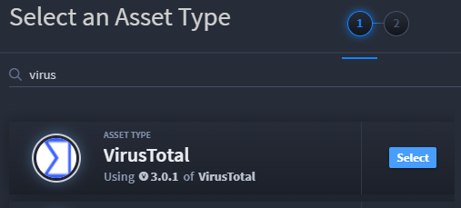
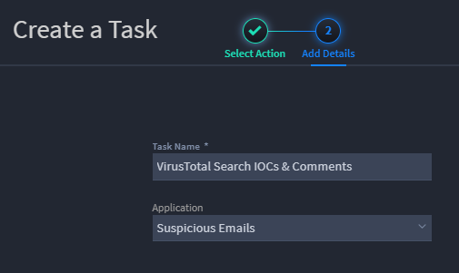
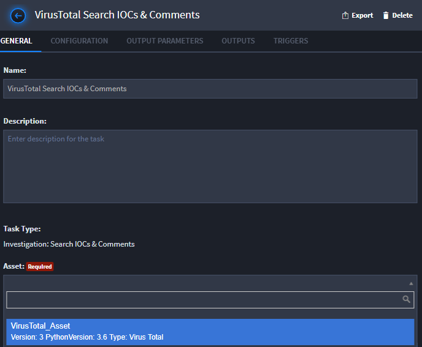
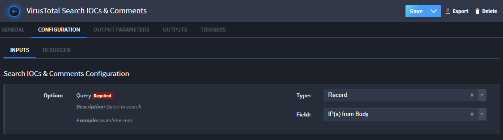

Create a VirusTotal Asset and Task
==================================

In the next part of this quick start exercise, use what you've learned
in the previous steps to create a VirusTotal asset and task.

**Important!** You must have an API key in order to set up the
VirusTotal asset. If you don't have one, create one, or contact your
Swimlane sales or support representative.

Create a VirusTotal Asset
-------------------------

To create a VirusTotal asset:

#. From the global navigation menu, select **Integrations.
   **

2. On Integrations, select the **Plugins** tab and verify that you have
   the **sw_virus_total** plugin uploaded.

If you do not have this plugin uploaded, contact your Swimlane
representative.

3. | Select the **Assets** tab and click the plus menu icon or the New
     Asset button to create a new asset. Select VirusTotal as the Asset
     Type.
   | |image1|

4. On the Configure your Plugin window, type in the API key for
   VirusTotal, enable **Verify SSL,** and then click **Save**.

Create a VirusTotal Task
------------------------

To create a VirusTotal task:

#. From the global navigation menu, select **Integrations.
   **

2. From the Integrations taskbar, click the plus menu icon, and then
   select **Create a task**. Filter for VirusTotal and select create on
   *VirusTotal IP Report.
   *

3. | On Create a Task, Add Details, name your task and associate it with
     the Suspicious Emails application. Click **Save**.
   | |image2|

4. | In your new task, associate it with the VirusTotal asset.
   | |image3|

5. Click the **Configuration** tab.

In order to get an analysis from VirusTotal, you need to provide an IP
address. Let's configure this task to dynamically send VirusTotal the IP
address collected in the *IP(s) from Body* field in our Suspicious
Emails application.

6. On the Configuration tab, select *Record* from the **Type** pulldown
   field, and then select *IP(s) from Body* as the **Field.**

|image4|

7. Next, on the Outputs tab click **Update Current Record.**

8. On the next screen, which asks you, "How would you like to proceed?"
   select **Map to Existing Fields.
   **

9. On Update Current Record, scroll through to review the Swimlane
   mapped parameters and fields and then select **Add Mappings to App.**

10. Click **Save**.

Related Links
-------------

`Assets <../../administrator-guide/integrations/create-or-edit-an-asset.htm>`__

`Configurations and Input
Mappings <../../administrator-guide/integrations/configure-task-input.htm>`__

`Integrations <../../administrator-guide/integrations/integrations.htm>`__

`Output
Mapping <../../administrator-guide/integrations/configure-task-output/configure-task-output.htm>`__

`Plugins <../../administrator-guide/integrations/upload-and-manage-plugins.htm>`__

`Tasks <../../administrator-guide/integrations/create-or-edit-a-task.htm>`__

