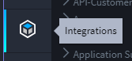
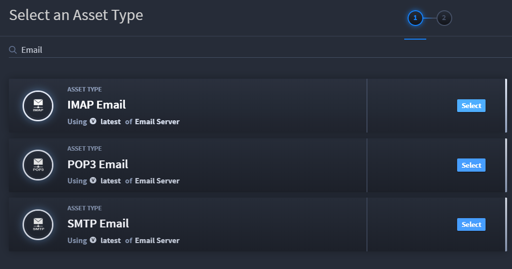
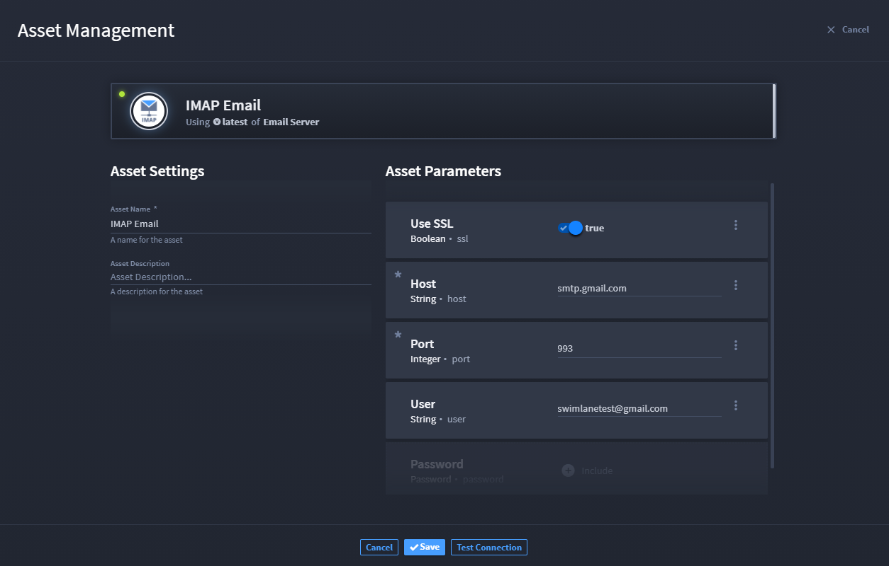
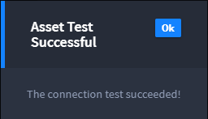
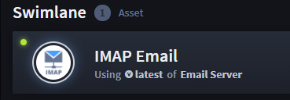

Create an IMAP Email Asset
==========================

To begin, you'll create an IMAP email asset.

Swimlane assets hold your configuration and authentication information
for connecting to third-party vendors.

To create an IMAP email asset:

#. Log in to Swimlane with your Chrome browser. From the global
   navigation menu, select Integrations.
   |image1|\ **
   Important!** Contact your Swimlane support or sales representative if
   you do not have log in credentials for Swimlane.

2. Select the **Assets** tab and then, from the Integrations taskbar,
   click the plus icon to create a new asset.

3. | In the Select an Asset Type window, filter for **Email**, and then
     click **Select** on the *IMAP Email* asset.

   |image2|

4. Under Asset Parameters, ensure that the **Use SSL** field is enabled
   and fill out the required **Host** and **Port** fields. In addition,
   complete the **User** and **Password** fields.
   |image3|

**Note:** The user and password you use here need to be real assets that
you have access to!

5. Next, click **Test Connection.
   **

6. Once you receive a message that the connection test has succeeded,
   click **Ok,** and then click **Looks Good** to save your new asset.
   |image4|

You can now see your asset listed under the **Assets** tab.

|image5|

You are ready for the next step, which is to create an application to
hold the email records we will eventually begin collecting through
automation.

Related Links
-------------

`Applications and
Applets <../../administrator-guide/applications-and-applets/applications-and-applets.htm>`__

`Assets <../../administrator-guide/integrations/create-or-edit-an-asset.htm>`__

`Integrations <../../administrator-guide/integrations/integrations.htm>`__

`Plugins <../../administrator-guide/integrations/upload-and-manage-plugins.htm>`__

