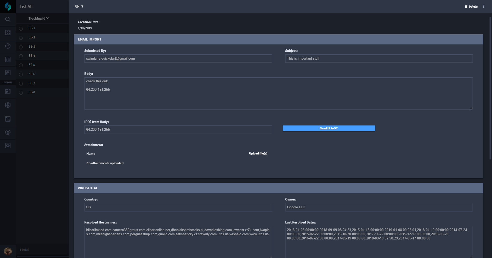

Test Your VirusTotal Automation
===============================

Finally, you're ready to test all the hard work you've put in to
automating a VirusTotal analysis!

To test your VirusTotal automation:

#. Access the Swimlane workspace that hosts Suspicious Emails records.

#. From another browser tab, send another email to the address you
   indicated in the IMAP email asset you created at the beginning of
   this exercise. See `Create an IMAP Email
   Asset <create-an-imap-email-asset.htm>`__ for details.

3. | Back in Swimlane, refresh the Suspicious Emails Default Report
     page, and then open the most-recent record.
   | |image1|

4. In the record, make changes to the IP address in the **IP(s) from
   Body** field, and then click **Save.**

5. Test the integration automation by clicking the **Send IP to VT**
   button.

Related Links
-------------

`Assets <../../administrator-guide/integrations/create-or-edit-an-asset.htm>`__

`Integrations <../../administrator-guide/integrations/integrations.htm>`__

`Records <../../user-guide/records/records.htm>`__

