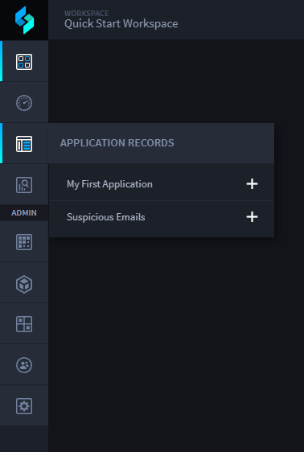
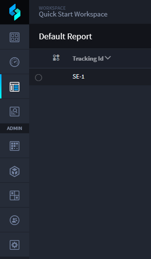

Verify That Your Task Works
===========================

You have created an IMAP email asset and a suspicious emails application
and task. At this point, test your task to make sure that your previous
setup is working!

To verify that your task works:

#. | From the global navigation menu, go to the workspace you assigned
     your Suspicious Emails application to.
   | |image1|

2. Hover over the Application Records icon, and click Suspicious Emails.

   |image2|

3. Next, open an email inbox and send an email to the address associated
   with the Swimlane Email asset.

4. Return to the Swimlane tab displaying the Default Report view of
   records for the Suspicious Emails application and wait for the email
   you sent to create the first record in your list.
   |image3|

Swimlane checks every 60 seconds or so for new emails. If you don't see
a record right away don't give up. You might also need to refresh your
browser to see the new record.

Once you see the record appear, pat yourself on the back.
Congratulations! Your task is working.

**Note:** Contact your Swimlane contact if your email record does not
appear in the Default Report view of the Suspicious Emails records after
waiting a reasonable amount of time.

Related Links
-------------

`Applications and
Applets <../../administrator-guide/applications-and-applets/applications-and-applets.htm>`__

`Assets <../../administrator-guide/integrations/create-or-edit-an-asset.htm>`__

`Records <../../user-guide/records/records.htm#top>`__

`Tasks <../../administrator-guide/integrations/create-or-edit-a-task.htm>`__

.. |image2| image:: ../../Resources/Images/left_nav_application_records.png

