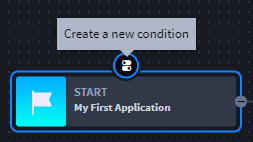
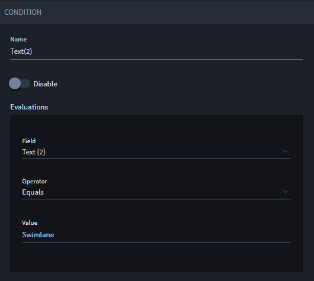
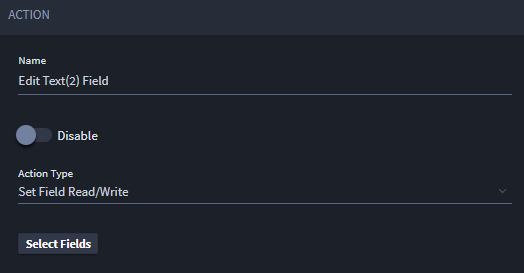
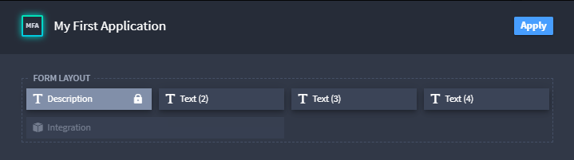
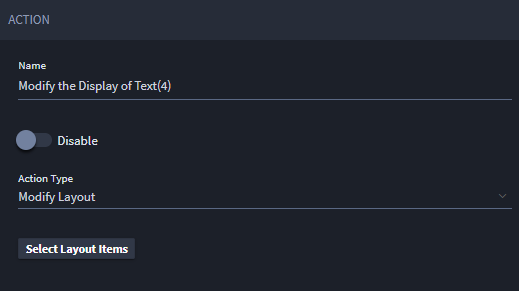
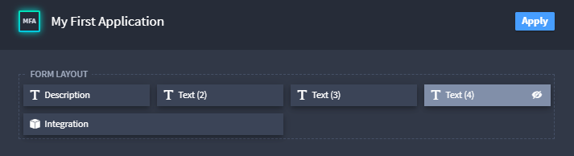
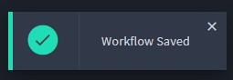

Add More Workflow Detail
========================

Now you are ready to add additional detail to your application's
workflow.

**Before You Begin:** From the global navigation menu, select
Applications and Applets and select your application again. Select the
workflow icon from the application toolbar.

To add more workflow details:

#. From within your application's workflow, select Start, or the
   beginning of your app's workflow, then click the icon to create a new
   condition.

   |image1|

#. Edit the Condition properties as shown in the following screen, then
   click **Save.**

   |image2|

#. Next, select your new condition and click the icon for *Create a new
   action.*

#. On Action, specify *Set Field Read/Write* in the **Action Type**
   pull-down field, then click **Select Fields.**

   |image3|

#. Select the field that you want to set the read/write action on.
   Select it once to lock the field, then select it again to make it
   editable.

   |image4|

   For example, the **Description** field above is locked. Note the lock
   icon.

   |image5|

   The **Text (2)** field above *is* editable. Note the pencil icon.

#. Next, create another action on this condition and, on **Action
   Type,** select Modify Layout.

   |image6|

   Click **Select Layout Items** to specify which application items you
   want to modify.

#. On the Layout window, select Text(4) to make it a hidden field.

   |image7|

#. Add one more action to this condition, and edit the action properties
   as shown in the following screen:

   |image8|

#. Click **Save** on the application builder taskbar.

   |image9|

Related Links
-------------

`Applications and
Applets <../../administrator-guide/applications-and-applets/applications-and-applets.htm>`__

`Workflow <../../administrator-guide/workflow/workflow.htm>`__

.. |image8| image:: ../../Resources/Images/action-set-description.png

