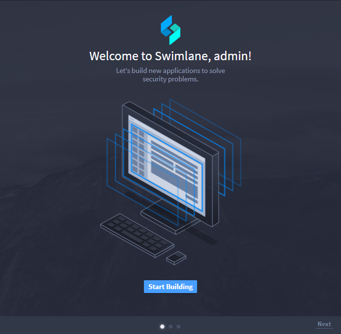
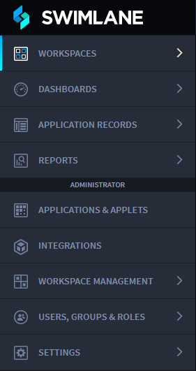
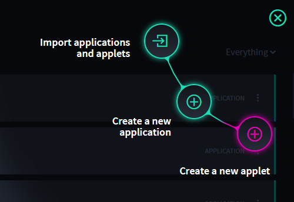
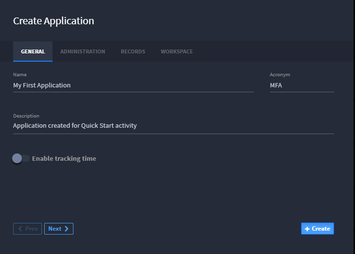
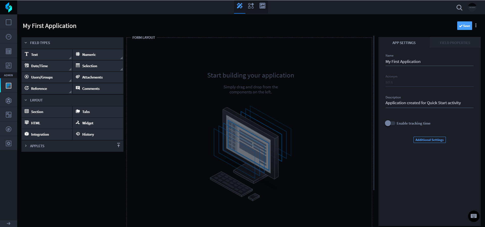
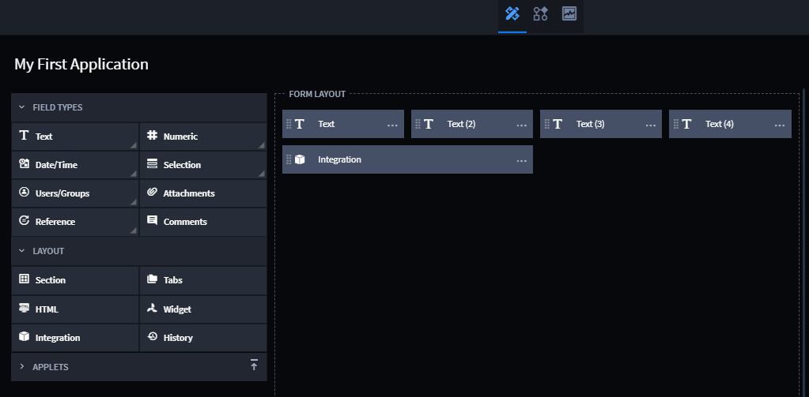
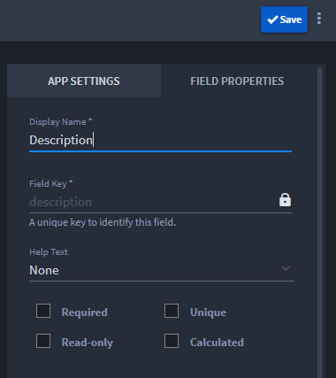

Build an Application
====================

To start, you must first build an application. Applications are
user-defined templates for collecting, storing, and organizing your
data. All automated activities and decisions are driven by how your
applications store data. You also manage workflow from within
applications, but we'll get to that in a bit.

First, you'll build your first application.

To build an application:

#. Open Swimlane and then, from the Welcome to Swimlane screen, click
   **Start Building.**

   |image1|

   Alternatively, from the global navigation menu, select **Applications
   & Applets.**

   |image2|

#. From the Applications and Applets home page, click the plus menu
   icon, and then select **Create a new application**.

   |image3|

#. On the Create Application, **General** tab, give your application a
   name, and (optionally) a description, and then click **Create.**

   |image4|

   **Note:** By default, when you create a new application, a new
   workspace with the name of the application is created. If you have a
   specific workspace where you would like this application to reside,
   you can specify it now on the Workspace tab of Create Application
   settings.

   Once you click **Create,** Application Builder opens. The builder
   consists of multiple areas: Field Types and Layout elements, the Form
   Layout, and the Application Settings and Field Properties.

   |image5|

#. Select four Text fields and one Integration button and drag them to
   the Form Layout area.

   |image6|

#. Rename the first Text field, **Description,** then click **Save.**

   |image7|

You are now ready to create the workflow for the application.

Related Links
-------------

For additional information, please see:

`Applications and
Applets <../../administrator-guide/applications-and-applets/applications-and-applets.htm>`__

`Integrations <../../administrator-guide/integrations/integrations.htm>`__

`Workflow <../../administrator-guide/workflow/workflow.htm>`__

