Create a Python Integration Task
================================

One of the most powerful features in Swimlane is the ability to kick off
an automation task. In this section you will create a simple Python task
that you'll be able to launch via the click of a button and
automatically. You will not only kick it off, but also pass a value from
your record into the script, manipulate it, then pass the results back
to your record.

The task you create will:

-  Receive an input from a field in a record.
-  Modify a variable of that field.
-  Output the modified variable back to a record.

Create a Task
-------------

To create a python integration task:

#. From the global navigation menu in Swimlane select **Integrations**.

   |image1|

#. From the Integrations taskbar, click the plus menu icon, or **New
   Task**, and then select **Create a Task**.

   |image2|

#. When you create a new task, you need to specify the assets the task
   will use. Filter for **Python** and locate the Python 3.6 plugin
   action.

#. Next, click **Create** at the end of the Python 3.6 plugin action to
   begin creating the task.

   |image3|

#. Name your new task, and then associate it to your new application.

   |image4|

#. On Create a Task, click **Save**.

   You now have a Python task associated to your application.

#. The task opens with the General tab. Enter a description on this tab,
   if you'd like, then click Configuration.

   |image5|

   In the next sub-task, you'll specify the code and the field inputs
   for your Python integration task.

Configure and Map Inputs to the Task
------------------------------------

#. On Configuration, enter the following Python code:

my_input_var = sw_context.inputs['text'] my_input_var = my_input_var + "
is the best" sw_outputs = [{'output': my_input_var}]

|image6|

Next, you set up Swimlane to grab the value of the **Text (2)** field
when the task runs. You do this by specifying an input mapping.

2. Below the Configuration window, under Inputs, click **Add
   Parameter,** then add the values shown here:

   |image7|

3. Click **Save**.

   Next, you map a value from your Python script back to a Swimlane
   record, also known as creating an output mapping.

Map the Outputs from the Task
-----------------------------

#. Click the Outputs tab. For this exercise, you'll be creating output
   mapping to update a current record. Click **Update Current Record.**

   |image8|

   If you're interested in learning more about other ways to map output,
   see `Configure Task
   Output <../../administrator-guide/integrations/configure-task-output/configure-task-output.htm>`__.

#. On the next screen, which asks you, "How would you like to proceed?"
   select **Map to Existing Fields.**

   |image9|

   Click through the next screen, which provides you with introduction
   to mapping.

   |image10|

#. On Update Current Record for your new application, note that multiple
   fields have been identified as potential parameters. For this
   exercise, you don't need to map those parameters, but instead to
   create a new one.

   Place your cursor in the text field preceded by the words **Add new
   output mapping for ...** and type "output" then click the adjacent
   plus (**+**) sign.

   |image11|

#. The output parameter is now available above. You need to map the
   parameter to a field, so from the **App Field / Field Type** pull
   down, select Description.

   |image12|

#. Click **Add Mappings to App.**

#. On Approve Field Creation and Mappings, review the mapping, and then
   click **Approve.**

   |image13|

#. From the Integration task bar, click **Save.**

   Next you'll set a trigger that will make the task run.

Set a Trigger for the Task
--------------------------

There are three ways to set triggers in Swimlane:

+----------------+-------------+-------------------------------------+
| Trigger Type   | Sub-type    | Definition                          |
+================+=============+=====================================+
| **Automatic:** | Scheduled   | The trigger is scheduled, like a    |
|                |             | cron job. You specify how often the |
|                |             | trigger is activated - minutely,    |
|                |             | hourly, daily, etc. This method is  |
|                |             | most commonly used when a task is   |
|                |             | collecting records from a database, |
|                |             | slack channel, or email inbox, for  |
|                |             | example.                            |
+----------------+-------------+-------------------------------------+
|                | Email       | The trigger is activated upon email |
|                |             | receipt.                            |
+----------------+-------------+-------------------------------------+
|                | Record Save | The trigger is activated when a     |
|                |             | record is saved.                    |
+----------------+-------------+-------------------------------------+
| **Workflow**   |             | The trigger is activated            |
|                |             | automatically when built into the   |
|                |             | workflow stages and actions.        |
+----------------+-------------+-------------------------------------+
| **Manual**     |             | The trigger is activated when the   |
|                |             | user manually pushes a button.      |
+----------------+-------------+-------------------------------------+

For this exercise, we are creating a manual trigger.

To set a trigger for the task:

#. Click the Triggers tab.

   |image14|

#. Click the Triggers, Manual tab, then click **Open Application
   Builder.**

   |image15|

   Application Builder opens your application, where you will associate
   the Python task to the application.

#. Select the Integration field in the Application Form Layout, then
   access the App Settings.

   On App Settings, access the Task dropdown and select your Python
   task, then click **Save.**

   |image16|

   On App Settings, you can also specify the size of the Integration
   button in a record. The example here is 100%.

   Now you're ready to test your automation.

Related Links
-------------

`Configurations and Input
Mapping <../../administrator-guide/integrations/configure-task-input.htm#Review>`__

`Output
Mapping <../../administrator-guide/integrations/configure-task-output/configure-task-output.htm>`__

`Tasks <../../administrator-guide/integrations/create-or-edit-a-task.htm>`__

`Triggers <../../administrator-guide/integrations/create-or-edit-a-task.htm#Set>`__

`Workflow <../../administrator-guide/workflow/workflow.htm>`__

.. |image1| image:: ../../Resources/Images/integration-button.png
.. |image2| image:: ../../Resources/Images/create-new-task.png
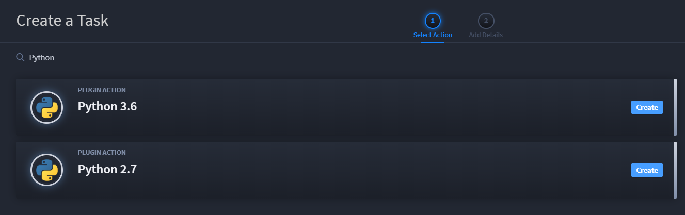
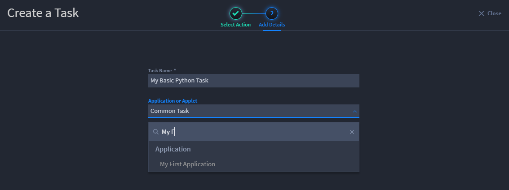
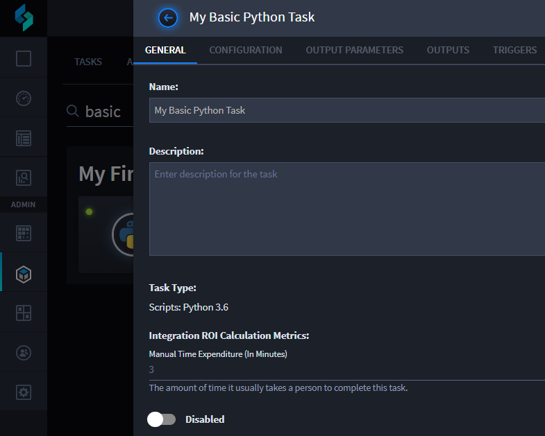
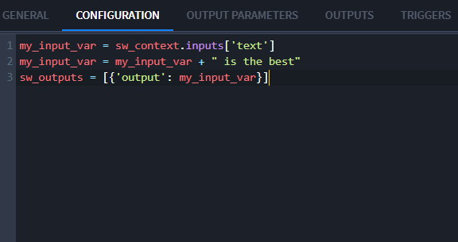
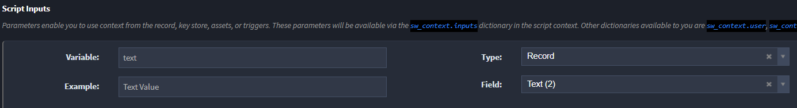
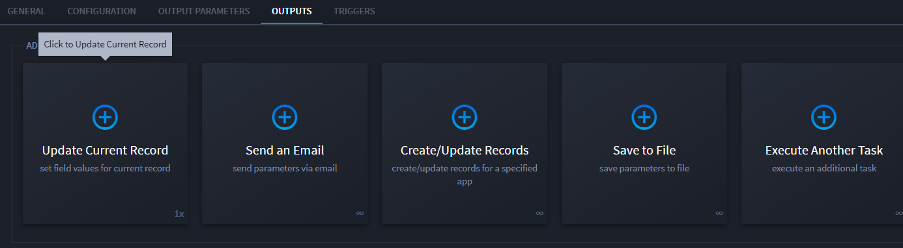
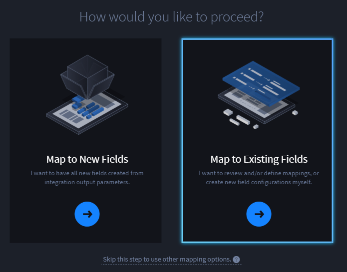
.. |image10| image:: ../../Resources/Images/the_basics.png
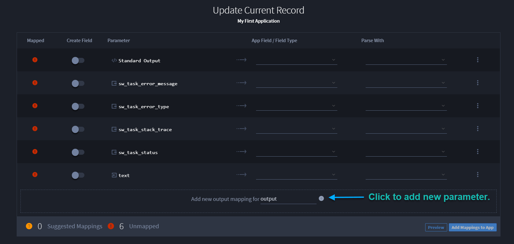
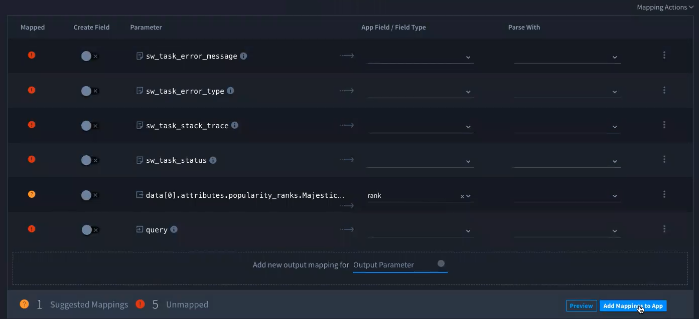
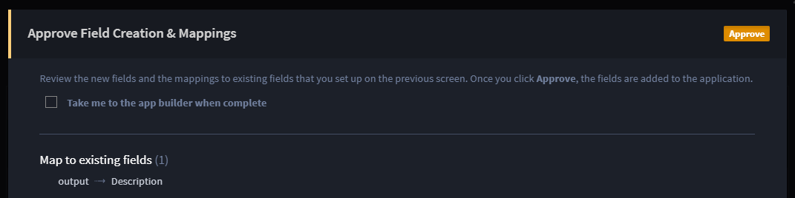
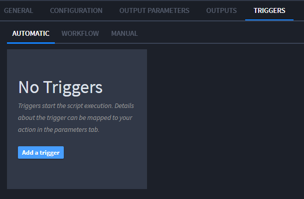
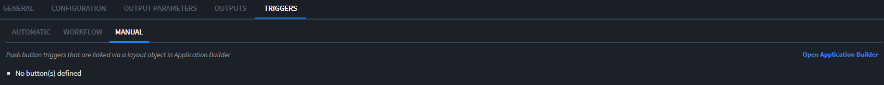
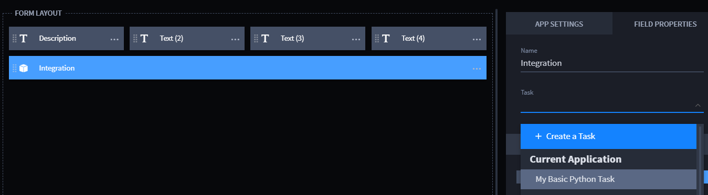
