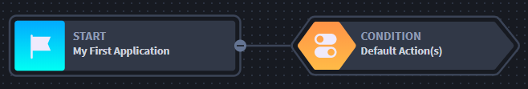
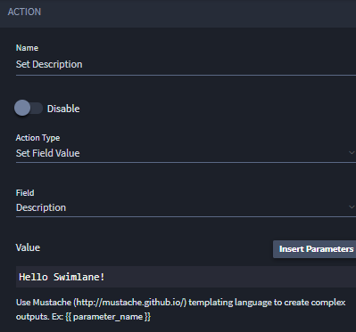

Create the Initial Workflow
===========================

Workflow automations are connected to applications. The workflow
automation tree is evaluated from left to right every time the record is
modified (or initially first viewed).

There are three components that make up Swimlane workflow:

-  **Stages:** Conditions that must be met to trigger or initiate an
   action. (These are your "if" statements.)
-  **Actions:** Automated tasks (These are your "then"
   statements/actions.)
-  **Repeats:** Repeats iterate over a Text List or Numeric List field
   and perform an action for each value in a list. (The Quick Start
   scenarios do not use Repeats in workflow.)

To create workflow:

#. From your newly-built application, select Workflow from the
   Application Builder toolbar.

   |image1|

   The workflow page opens. You should see the start of the workflow,
   which is your application, and an initial, default condition.

   |image2|

#. Select the workflow condition titled Default Action(s), then click
   the icon for *Create a new action.
   *

3. Edit the Action properties as shown here:

   |image3|

   When done, click **Save.**

   This default action will populate the Description text field when a
   record is first viewed.

4. To see the workflow in action, from the global navigation menu, hover
   over Application Records. Select **+** to add a new record.

   |image4|

5. A new record is added. Click **Save.**

   |image5|

   **Note:** The description field contains the text that you set up in
   workflow.

Related Links
-------------

`Records <../../user-guide/records/records.htm>`__

`Workflow <../../administrator-guide/workflow/workflow.htm>`__

.. |image1| image:: ../../Resources/Images/workflow-icon.png

.. |image4| image:: ../../Resources/Images/records-selection.png
.. |image5| image:: ../../Resources/Images/new-added-record.png
