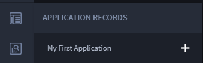
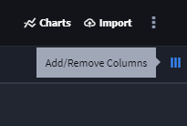
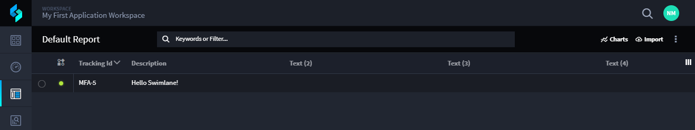
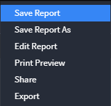

Customize Record Views
======================

You now have one record in your new application. Records in Swimlane are
organized within reports. Each application has a Default Report.

To see the report, hover over Application Records and click the name of
your application.

|image1|

Now you can see the one record you just created in the Default Report
for your application. Records are initially viewed only by Tracking ID,
but you can customize the view of the report to add more context.

To customize record views:

#. To add more columns to the record layout, click **Add/Remove
   Columns.**

   |image2|

   Each field that you added to the application is available to be
   viewed as a column.

#. Select all the columns and click **Apply.**

   |image3|

#. To save this view to the Default Report, from the Default Report
   ellipsis menu, select **Save Report.**

   |image4|

Related Links
-------------

`Records <../../user-guide/records/records.htm>`__

`Keyword Search and
Filter <../../user-guide/reports/keyword-search-and-filter.htm>`__

