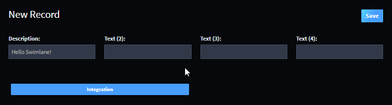
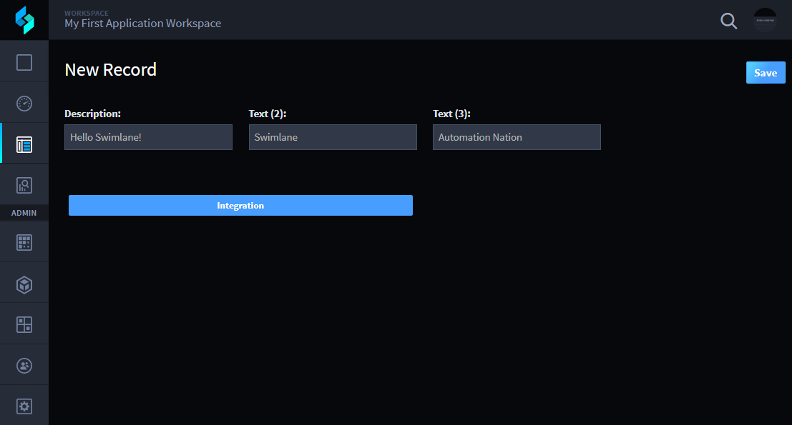

Test Record Automation
======================

Now you're ready to test the automations that you just created in
workflow. You'll be able to view the automation in the Default Reports
records view, so switch to the browser tab you created earlier to view
Swimlane in User Mode.

To test automations in records:

#. From the navigation menu, click **+** to add another new record.

   |image1|

   The record opens with all of the fields you initially created in
   Application Builder.

   |image2|

#. On New Record, place your cursor in the **Text (2)** field and type
   the word Swimlane.

   |image3|

   The word Swimlane triggered the automations that you set up in the
   workflow. The Text(4) field is now hidden, and the Text(3) field is
   populated with the value you specified in the previous task.

#. Click **Save** to save the record.

Related Links
-------------

`Records <../../user-guide/records/records.htm>`__

`Workflow <../../administrator-guide/workflow/workflow.htm>`__

.. |image1| image:: ../../Resources/Images/records-selection.png

