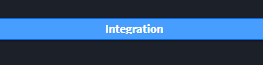
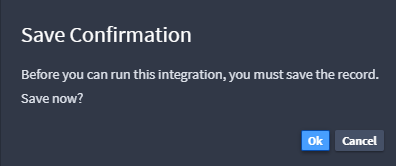
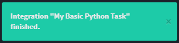
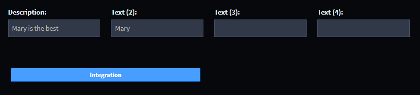

Test the Latest Automation in Records
=====================================

To test the latest automations in records:

#. From the global navigation, hover over **Application Records** and
   select **+** to add a new record.

   |image1|

#. On New Record, enter your name in **Text (2).**

   |image2|

#. Tab out of the Text (2) field, then click **Integration.**

   |image3|

   You will be prompted to save the record. Click **OK.**

   |image4|

#. Swimlane saves your record, and then runs the integration task.
   You'll receive notification when the integration task has finished.

   |image5|

#. The integration task has changed the Description field text. Take a
   look!

   |image6|

Related Links
-------------

`Integrations <../../administrator-guide/integrations/integrations.htm>`__

`Records <../../user-guide/records/records.htm>`__

`Workflow <../../administrator-guide/workflow/workflow.htm>`__

.. |image1| image:: ../../Resources/Images/add-new-record.png
.. |image2| image:: ../../Resources/Images/new-added-record.png

