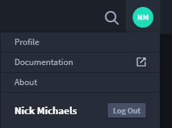
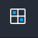
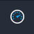
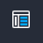
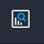
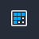
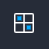
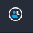
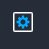

Navigation Basics
=================

Swimlane is organized into workspaces and dashboards where you can view
additional detail about the applications, records, and reports that you
manage within Swimlane.

The workspaces, dashboards, records, reports, applications, and applets,
among other features in Swimlane, are all permission-driven. You must be
given permission as a user, or for your role within your organization,
in order to be able to view or otherwise modify a specific feature of
Swimlane.

If you have administrator permissions on workspaces, dashboards, users,
groups or roles, or tasks, you will be able to view and access them from
an Admin menu that appends itself to the navigation menu.

**Important!** Access Swimlane with the Google Chrome browser.

Profile Options
---------------

You access Profile Options from the upper right corner of the Swimlane
User Interface (UI). The Profile Options sub-menu is where you can begin
to complete the following basic tasks:

-  **Profile:** edit user details, set password and personal access
   token, and see activity
-  **Documentation:** access Swimlane platform documentation
-  **About:** see Swimlane version, build, and copyright information
-  **Log Out:** end active user session

|image1|

Global record search is also available from the upper right corner of
the Swimlane UI. For more information, see `Search Record
Data <../user-guide/records/search-record-data.htm>`__.

Navigation Menu Options
-----------------------

The menu on the left side of the screen is the global navigation menu.
Use this menu to navigate to the different areas of Swimlane.

The menu can be minimized.

+-----------+---------------------------+---------------------------+
| Icon      | Function                  | Additional Information    |
+===========+===========================+===========================+
| |image20| | Select a Workspace        | Click to select a         |
|           |                           | workspace from a list of  |
|           |                           | workspaces.               |
+-----------+---------------------------+---------------------------+
| |image21| | View a Dashboard          | Click to view the         |
|           |                           | dashboards associated     |
|           |                           | with a specific           |
|           |                           | workspace.                |
+-----------+---------------------------+---------------------------+
| |image22| | View an Application's     | Click to view, create,    |
|           | Records                   | and edit records.         |
+-----------+---------------------------+---------------------------+
| |image23| | View All Reports          | Click to view reports.    |
+-----------+---------------------------+---------------------------+
| |image24| | Manage Applications and   | Click to access a list of |
|           | Applets                   | applications and applets  |
|           |                           | that you can manage,      |
|           |                           | edit, update, etc.        |
+-----------+---------------------------+---------------------------+
| |image25| | Manage Integrations,      | Click to access           |
|           | Assets, and Tasks         | integrations, assets, and |
|           |                           | tasks.                    |
+-----------+---------------------------+---------------------------+
| |image26| | Manage Workspace and      | Click to manage the       |
|           | Dashboard Administration  | administrative tasks for  |
|           |                           | workspaces and            |
|           |                           | dashboards.               |
+-----------+---------------------------+---------------------------+
| |image27| | Manage Users, Groups, and | Click to access the       |
|           | Roles                     | users, groups, and roles  |
|           |                           | and their respective      |
|           |                           | permissions.              |
+-----------+---------------------------+---------------------------+
| |image28| | Settings                  | Click to access           |
|           |                           | Swimlane's Settings. This |
|           |                           | is accessible to          |
|           |                           | administrators only.      |
+-----------+---------------------------+---------------------------+

The icons visible to you in the global navigation panel are dependent
upon what you have permission to view, access, create, modify, and
update.

Click the Swimlane logo in the upper left corner of the UI to go to the
default workspace and dashboard for your instance of Swimlane.

