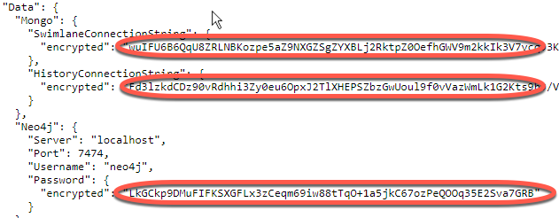

Appsettings.json Password Obfuscation
=====================================

By default, passwords are saved as plain text in the Tasks and API
appsettings.json files. The following instructions detail how to allow
obfuscation of these passwords, if desired.

**Note:** Obfuscating passwords is not a security measure, instead it is
available to those who would like to configure their install this way.
Running the commands below will result in obfuscated passwords similar
to this:

|image1|

Tasks
-----

Run the following commands from an administrator Command Line (cmd.exe):

-  pushd "C:\\Program Files\\Swimlane"
-  dotnet tasks.dll encryptinfile -f .\\appsettings.json -s
   $.Data.Mongo.SwimlaneConnectionString
-  dotnet tasks.dll encryptinfile -f .\\appsettings.json -s
   $.Data.Mongo.HistoryConnectionString

Additional commands and options are described by typing the following:

-  dotnet tasks.dll -h
-  dotnet tasks.dll encryptinfile --help
-  dotnet tasks.dll encrypttofile --help

API
---

Run the following commands from an administrator Command Line (cmd.exe):

-  pushd C:\\inetpub\\API
-  dotnet api.dll encryptinfile -f .\\appsettings.json -s
   $.Data.Mongo.SwimlaneConnectionString
-  dotnet api.dll encryptinfile -f .\\appsettings.json -s
   $.Data.Mongo.HistoryConnectionString

View additional commands and options by typing the following:

-  dotnet api.dll -h
-  dotnet api.dll encryptinfile --help
-  dotnet api.dll encrypttofile --help

