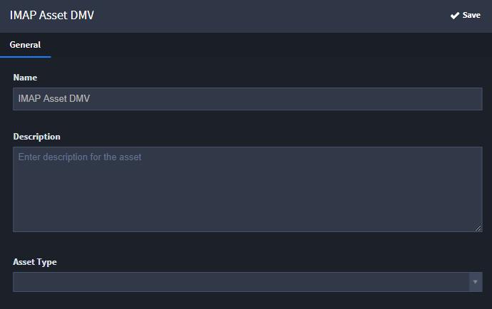
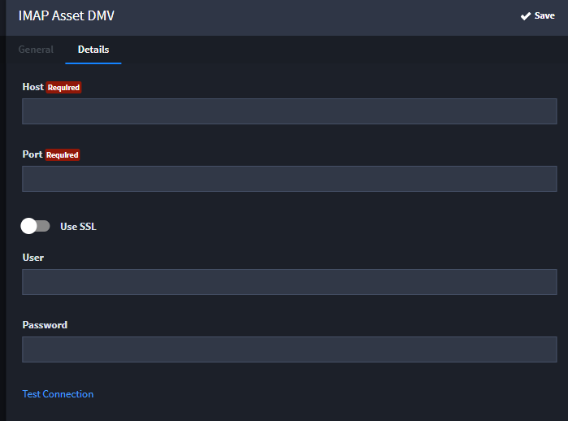
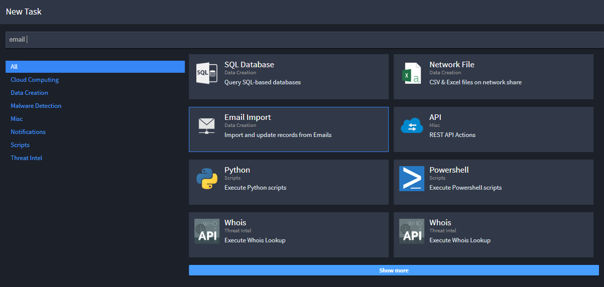
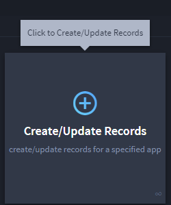
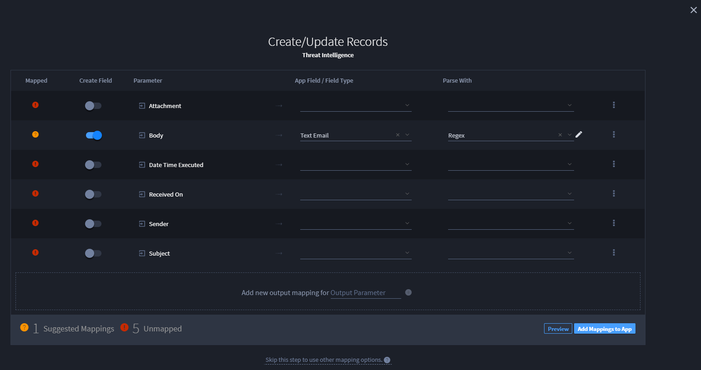

Email Import
============

You must have administrator access in order to set up email import.

**Note:** If you want to set up S/MIME email decryption, add the email
certificate in Microsoft Certificate Manager.

Follow these steps once you have a mail server setup that allows IMAP
connections.

Set Up the Email Import Asset and Task
--------------------------------------

To set up the email import asset and task:

#. From the navigation menu, open Integrations.

#. On Integrations, select **New Asset.**

   |image1|

   When you create assets, you create configuration settings to the
   technology, host, or application that you are integrating with
   (hostname, username, passwords, etc.).

#. On New Asset, name the asset and provide a description (optional).

#. Click Asset Type and select IMAP Email.

   |image2|

#. Click **Details,** and complete the **Host,Port,User,** and
   **Password** fields.

   |image3|

   Click **Use SSL,** and **Test Connection** as needed.

   When you're finished with the settings on the General and Details
   tabs for the asset, click **Save.**

#. On Integrations, select **New Task.**

#. On New Task, select Email Import and then click **Create.**

   |image4|

#. On New Task\\Email Import, name the task and then specify the Related
   Application.

   You can now set up the task configuration.

Set Up the Task Configuration
-----------------------------

To set up the task configuration:

#. From the open task that you just created, click **Outputs** and then
   define your output mappings. Click Create/Update Records to begin.

   |image5|

   Specify the values to read from the email, and then define where to
   handle the values in your application. See `Configure Task Output
   Types <../../administrator-guide/integrations/configure-task-output/configure-task-output.htm>`__
   for more information.

#. (Optional) Define a regex parser to grab a subset of information from
   the message body.

   |image6|

.. |image2| image:: ../../Resources/Images/assettype.png

