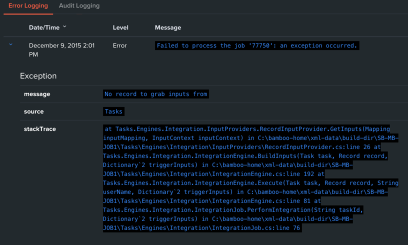

Troubleshooting and Error Notifications
=======================================

|image1|

When an error occurs, the best place to look for more information is the
Swimlane error logs found in Settings. The error logs contain a detailed
message about the error, its source, and a stack trace for debugging
purposes. Errors that occur in the Swimlane web server, task service, or
client will all appear here.

.. toctree::
   :titlesonly:
   :caption: Children:

   /Content/user-guide/records/modify-a-record/coedit-records
   /Content/server-administrator-guide/troubleshooting-and-error-notifications/directory-services-synchronization-field-attribute-mappings
   /Content/server-administrator-guide/troubleshooting-and-error-notifications/testing-connections-in-directory-services
