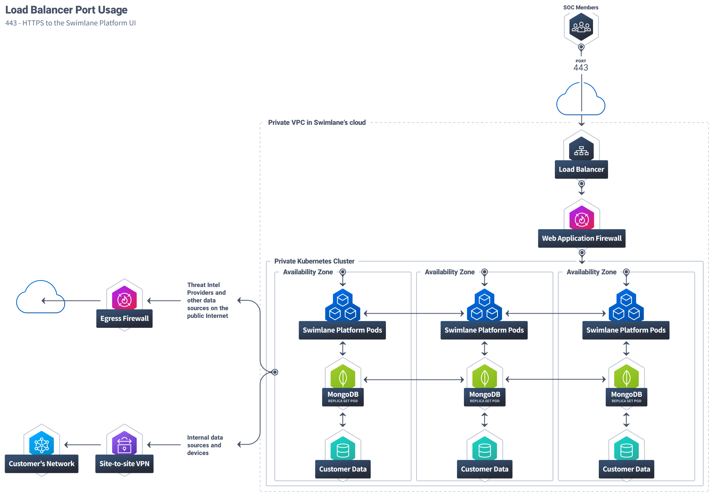

Swimlane Cloud Architecture
===========================

Access to Swimlane cloud is over HTTPS encrypted with TLS 1.2. Inbound
traffic is protected by a web application firewall (WAF). Data is then
load balanced across dedicated infrastructure in multiple zones for high
availability. Outbound traffic to external integrations is protected by
an egress firewall and data stored in Swimlane is encrypted at-rest
using the AES-256 algorithm.

|image1|

