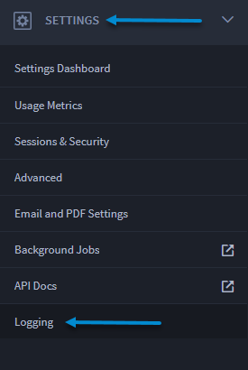
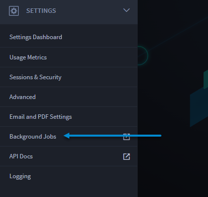
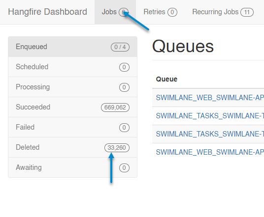

Gather Diagnostic Data for Integration Troubleshooting
======================================================

When you need to contact Swimlane support for assistance, you should
include diagnostic data. This topic instructs you how to find
preliminary data for troubleshooting integration failures.

Before you begin, jot down your answers to the following questions:

-  Are all the integrations failing? Or is it just one, or just a few
   that are failing?

-  What type of integrations are failing? Is it a Python script, a
   forked task, or a plugin task?

   -  If it is a plugin task, take note of the plugin name, version, and
      the name of the task that is being used.

-  What failure errors are you getting when the integration fails?
   (Include screenshots of any errors in the UI if possible.)

-  Next, check the most recent logs from Swimlane logging.

   |image1|

To gather diagnostic data for integration troubleshooting:

#. In Swimlane, replicate the issue and capture a HAR file:

If you need information on how to capture a HAR file, see these
`instructions <https://toolbox.googleapps.com/apps/har_analyzer/>`__.

2. Navigate to Background Jobs, which opens Hangfire.

|image2|

Take screenshots of the most recent jobs from the Hangfire Deleted queue
and provide the full stack trace of the error.

|image3|

3. Connect to MongoDB. Run the following query to find additional
   diagnostic information for the most-recently encountered errors:

   ``db.Logs.find({Level:'Error'}).sort({Date:-1}).limit(30).pretty()``

