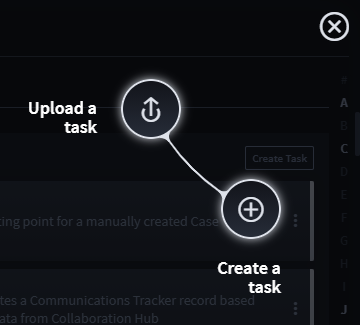
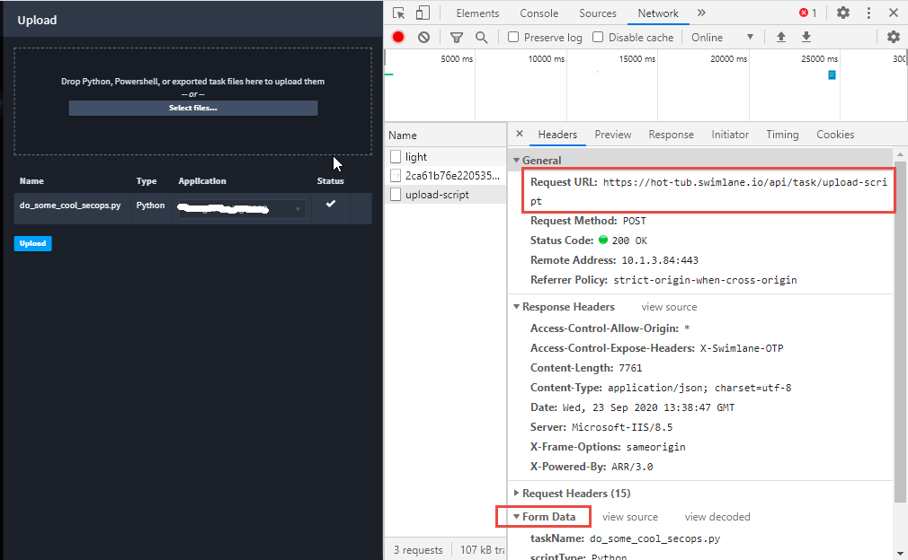
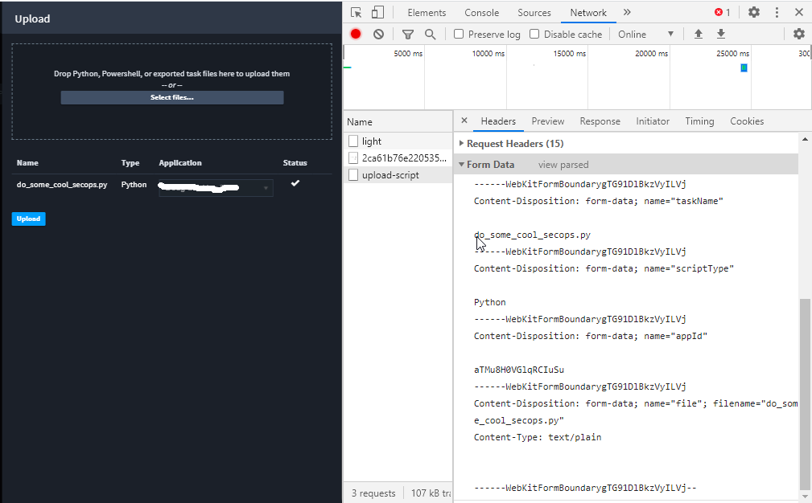

Upload a Python Script with the POST Script Endpoint
====================================================

Many of the Swimlane RESTful API endpoints require JSON payloads.
However, the POST /task/upload-script endpoint requires
multipart/form-data.

You upload JSON files from accessing **Upload a task** on the
Integrations/Tasks tab.

|image1|

Here is an example of a successful POST:

|image2|

Here is the POST body payload that needs to be replicated in client
Python code:

|image3|

This Python 2.7 code sample, which relies on the Swimlane Driver for
authentication and for ease of retrieving the pertinent application’s ID
value, illustrates how to make this POST:

from swimlane import Swimlane host = 'https://SWIMLANE-HOST' swimlane =
Swimlane(host, 'USER', 'PASSWORD', verify_ssl=False) app =
swimlane.apps.get(name='APPLICATION-NAME') resp = swimlane.request(
'post', '/task/upload-script', data=[ ("taskName",
"do_some_cool_secops.py"), ("scriptType", "Python"), ("appId", app.id)
], files={ "file": open(r'C:\\Swimlane\\shared\\do_some_cool_secops',
'rb'), "contentType": "text/plain" } ) print str(resp.status_code) print
resp.text

Swimlane supports Python scripts and Powershell scripts.

