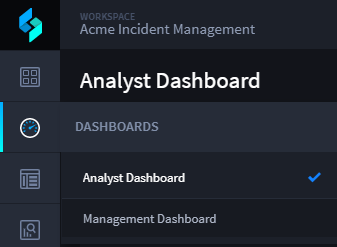
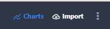

Charts
======

You can visualize data and create reports with charts.

To view charts:

#. Open the Default Report (or any report) view of Application Records.

   |image1|

#. Click **Charts** on the Default Report taskbar.

   |image2|

.. toctree::
   :titlesonly:
   :caption: Children:

   /Content/user-guide/charts/chart-types
   /Content/user-guide/charts/measures-and-dimensions
   /Content/user-guide/charts/chart-options
   /Content/user-guide/charts/colors
   /Content/user-guide/charts/sorting
   /Content/user-guide/charts/drill-in
