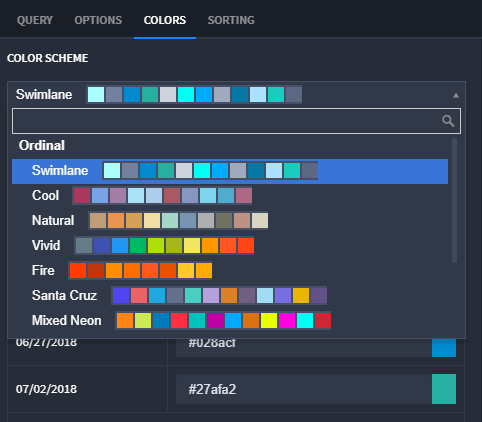
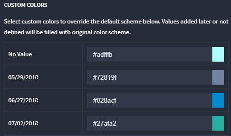

Colors
======

The color scheme for charts can be configured on the Colors tab in the
chart configuration panel. To change the color scheme, click the Color
Scheme dropdown and select from the preset color palette.

|image1|

Colors for individual data items can be changed under Custom Colors. To
change a color for a single data item, click on the input indicating the
hex value of the color and select the color, or input the hex value
directly.

|image2|

