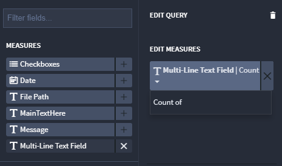
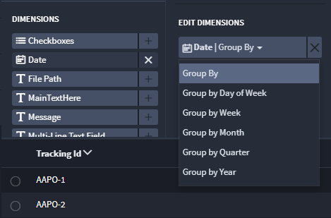

Measures and Dimensions
=======================

Every chart has a number of measures and dimensions that can be
visualized. The number of dimensions and measures needed for the chart
is indicated by a status message in the chart preview section.

The measures and dimensions on the chart are configured through the
Query tab in the chart configuration section. All of the available
fields that can be selected as a measure or a dimension are listed in
the left side of the query section. The right side shows the
currently-selected measures and dimensions.

Measures
--------

To add a measure to the query, either click the **+** button to the
right of the measure in the Measures list, or drag and drop the measure
into the marked placeholder under **Edit Measures.** To remove a measure
from the query, click the **x** button to the right of the measure in
the **Edit Measures** list.

Measures have an aggregate function that is used to calculate the
numeric value of the data item. This function must return a number. All
fields except numeric fields have one available aggregate function,
Count of. Numeric fields also have Sum of, Average of, and Min of
options.

To change the aggregate function for a measure, click on the measure and
select the desired function from the dropdown.

|image1|

Dimensions
----------

To add a dimension to the query, either click the **+** button to the
right of the dimension in the Dimensions list, or drag and drop the
dimension into the marked placeholder under "Edit Dimensions". Users can
select as many dimensions as the chart type allows. Once all available
dimension spot for the chart are filled, adding anew dimension will
remove one of the existing dimensions. To remove a dimension from the
query, click the **x** button to the right of the dimension in the "Edit
Dimensions" list.

The order of dimensions in the query matters. To reorder a dimension,
drag and drop it to the desired location in the **Edit Dimensions**
list.

Date fields support multiple options for the **Group By** function.
Select from: Group by Day of Week, Group by Week, Group by Month, Group
by Quarter, Group by Hour. To change the function, click on the
dimension and then re-select the desired function from the dropdown.

|image2|

