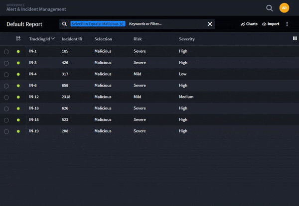
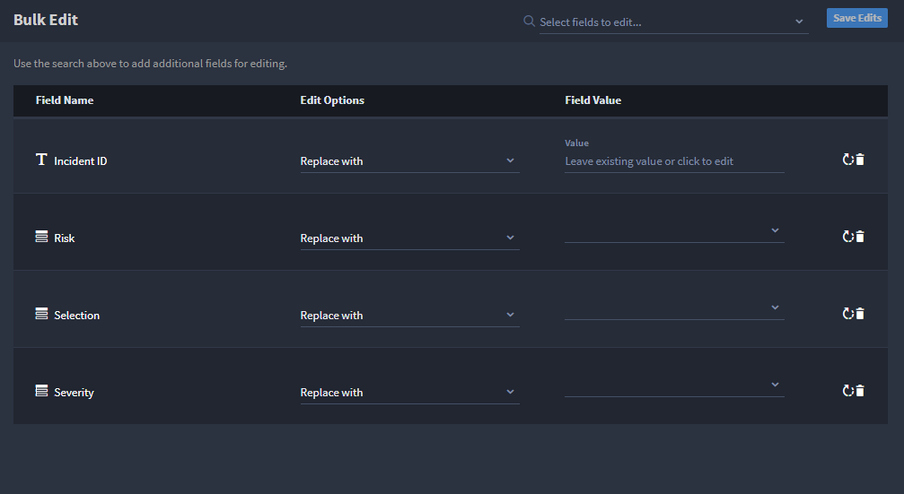
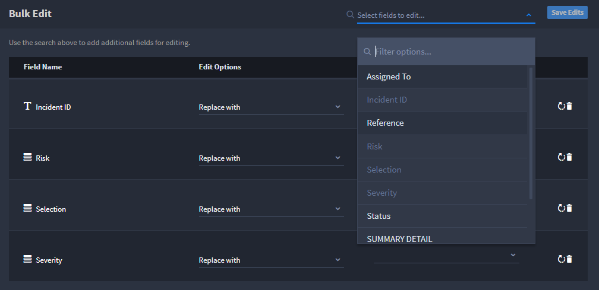
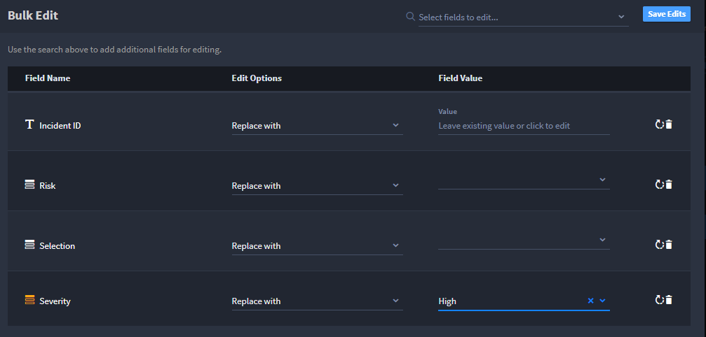
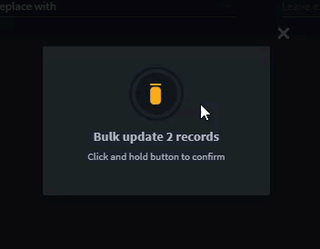
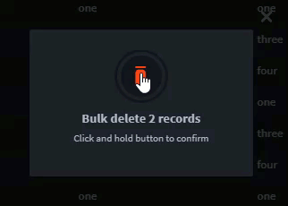

Bulk Modify Records
===================

Click a record to open the record. You make updates to the record and
save, and then you interact with another record.

When you have changes that you want to apply to multiple records, you
can bulk modify data for 2 or more records.

You can use the filters and keywords in the Default Report taskbar when
searching for and selecting records for bulk modification.

You can both modify and delete records in bulk.

Bulk Modifying Records
----------------------

To apply field changes to multiple records, your account must have the
following permissions:

-  Records: Modify and lock
-  Fields: Role-based read and update

You must be in a report view of records to use the bulk modify and
delete features.

To bulk modify records:

#. From the report view of records, just to the left of the **Tracking
   ID** column header, select the records that you want to be bulk
   modified or deleted.

   |image1|

   The Bulk Edit task bar appears once you select a record.

#. Select additional records, as needed. You must select at least 2
   records to utilize Bulk Edit tasks.

   You can select all records with the **Select All** button, or
   deselect the current selections with the **Clear** button.

#. Select **Bulk Edit.**

   |image2|

   The Bulk Edit window opens, listing fields you currently have
   viewable in the current report view of records.

   To open additional fields, click the search filter at the top of the
   window and select the fields.

   |image3|

#. Review the **Field Name** then, under **Edit Options,** specify
   whether you want the value to replace the existing value, or whether
   you want to modify the existing value by clearing it.

#. On Field Value, specify the value that you are replacing.

   |image4|

   Continue to modify the Edit Options and Field Value fields as needed
   for the record and then click **Save Edits.**

#. Clicking save opens a pop-up window where you will confirm the bulk
   action.

#. Click and hold the **Bulk Update** button. Hold the button until you
   see the Updating Records notification.

   |image5|

#. Click **Close.** The bulk update process has initiated. You will
   receive notification once all records have been updated.

|image6|

Bulk Deleting Records
---------------------

+> **Note:** Users must have Delete and Lock permissions set in order to
bulk delete records.

To bulk delete records:

#. Access records like described above in the Bulk Modify process.

#. Select more than one record that you want to delete. The Bulk Options
   taskbar appears.

#. Select **Delete.**

#. Clicking **Delete** opens a pop-up window where you will confirm the
   bulk action.

#. Click and hold the **Bulk Update** button. Hold the button until you
   see the Updating Records notification.

   |image7|

#. Click **Close.** The bulk update process has initiated. You will
   receive notification once all records have been deleted.

