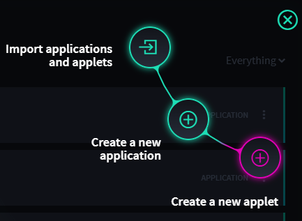
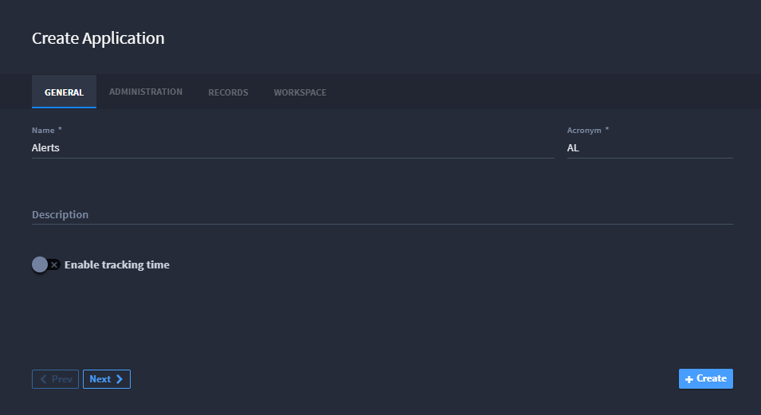
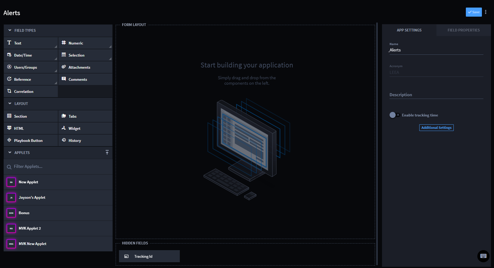
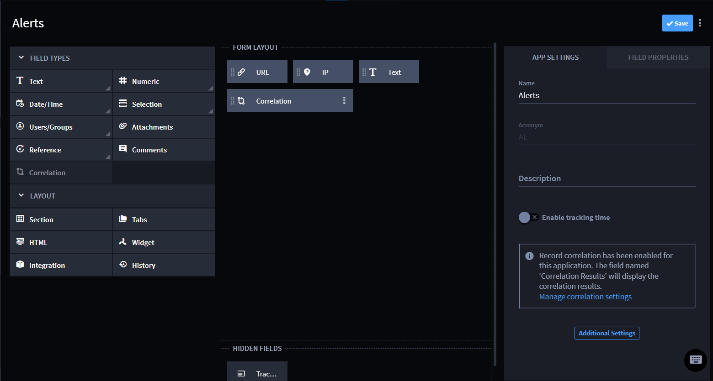
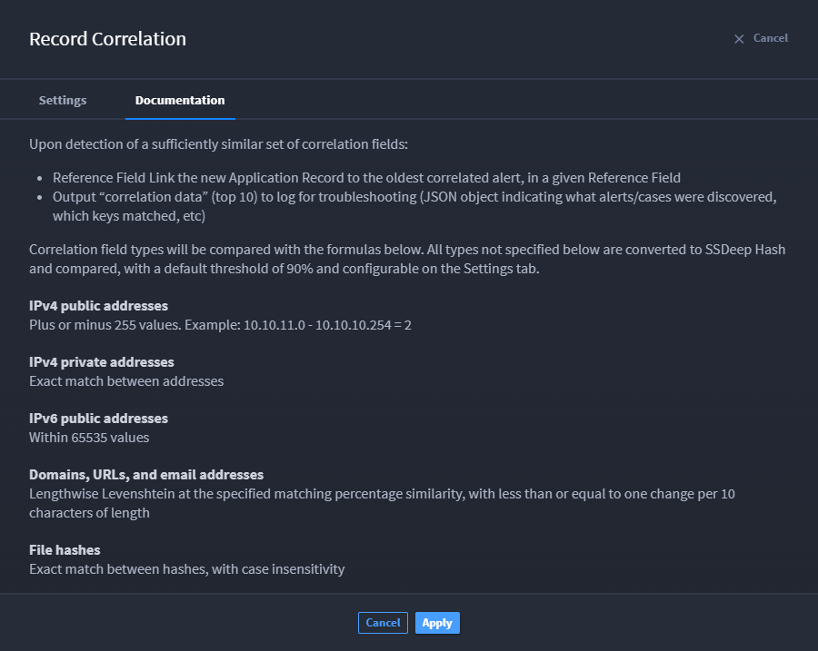
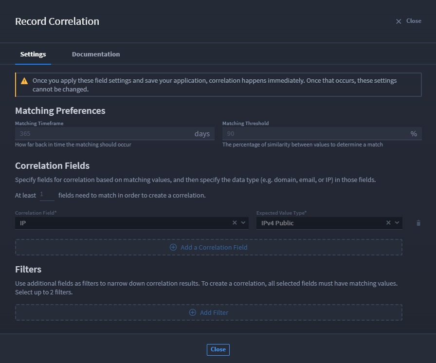
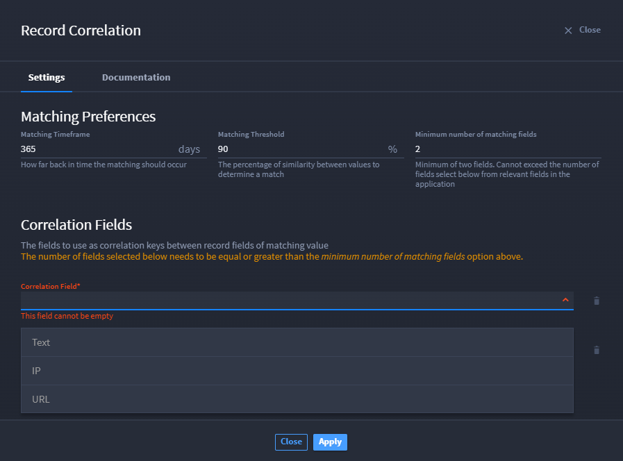
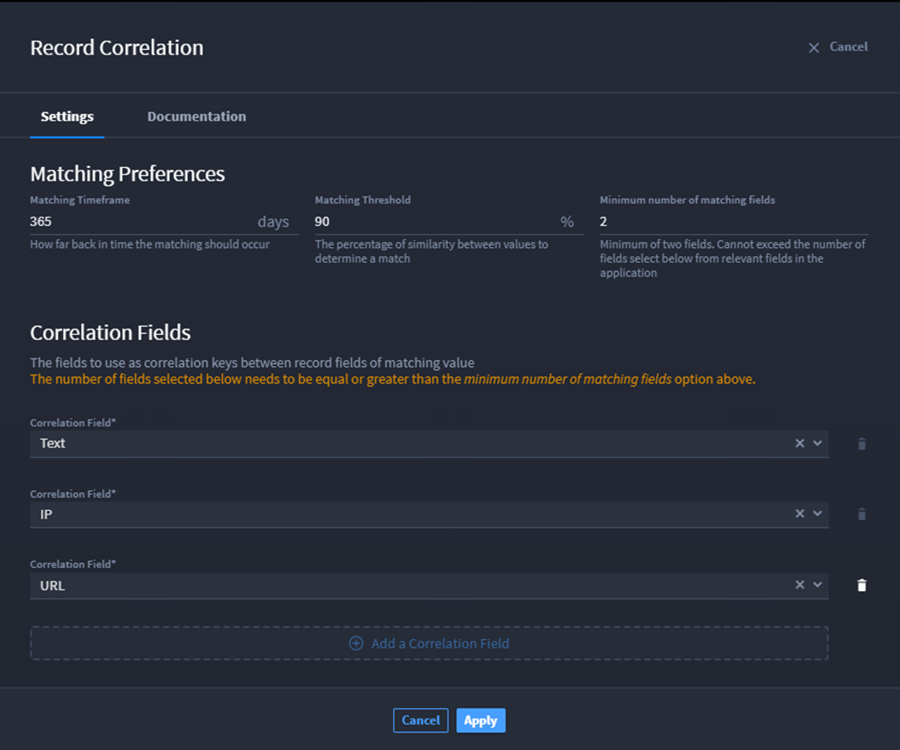

Correlate Records
=================

Record correlation correlates records within a single application within
the Swimlane platform. Upon ingestion of new Application records, the
platform compares the new record to previous records that have
correlation keys.

Record Correlation executes two tasks:

-  Compares Correlation Key fields across records in a single
   application, looking for configurable similarities.
-  Creates References in a Reference field among associated records.

The correlation field types in the following table are aligned with
their default configurations and will be compared with the matching
preferences on the Settings tab:

+----------------------------------+----------------------------------+
| **Correlation Field Type**       | **Value and Default              |
|                                  | Information**                    |
+==================================+==================================+
| IPv4 public addresses            | Plus or minus 255 values.        |
|                                  | Example: 10.10.11.0 –            |
|                                  | 10.10.10.254 = 2                 |
+----------------------------------+----------------------------------+
| IPv4 private addresses           | Exact match between addresses    |
+----------------------------------+----------------------------------+
| IPv6 public addresses            | Within 65535 values              |
+----------------------------------+----------------------------------+
| Domains, URLs, file names, and   | Has a threshold of 90%           |
| email addresses                  | similarity, calculated via       |
|                                  | “lengthwise Levenshtein” of less |
|                                  | than 1 character substitution    |
|                                  | per 10 characters of string      |
|                                  | length                           |
+----------------------------------+----------------------------------+
| File attachments                 | Fuzzy hash similarity greater    |
|                                  | than or equal to 90%             |
+----------------------------------+----------------------------------+
| Text list fields                 | Matches process as entry fields, |
|                                  | so 2 items will match with 2.    |
+----------------------------------+----------------------------------+

Configure Record Correlations
-----------------------------

To configure record correlations:

#. From the Navigation menu, select **Applications and Applets**.

#. Click the **plus** icon, and then click **Create a new application**.

|image1|

3. On Create Application, complete the **Name** field. You can click the
   GENERAL, ADMINISTRATION, RECORDS, or WORKSPACE tabs to add
   information or use the **Next** and **Prev** buttons to move through
   the tabs.

4. Click **+Create**.

|image2|

Once you click the +Create button, the new application opens in the
application builder.

The FORM LAYOUT section will be blank.

|image3|

6. Click and drag the following field types into the FORM LAYOUT section
   to start building your application: **Text**, **IP**, **URL**, and
   **Correlation**.

The FORM LAYOUT section will reflect all of the required field types for
record correlation.

|image4|

Now, record correlation has been enabled for this application. The field
named **Correlation Results** will display the correlation results.

6. To setup correlation settings, click **Manage correlation settings**
   hyperlink.

|image5|

From the Record Correlation window, you will be able to manage data.

7. For details about how record correlation executes and default values
   for specific Correlation field types, click the **Documentation**
   tab.

|image6|

Once you have read details about the correlation process and data,
navigate back to the **Settings** tab.

|image7|

From Settings, there will be three Matching Preferences fields:
**Matching Timeframe**, **Matching Threshold**, and **Minimum number of
matching fields**. Each field has a default value. Click within the
field to modify the default value.

8. After you set the Matching Preferences, click the **Correlation
   Field** drop-down arrow and select a field type.

   |image8|

   i> **Tip:** Click **Add a Correlation Field** to create another
   drop-down list.

   Complete this for each required Correlation Field drop-down.

   |image9|

9. To save record correlation settings, click **Apply**.

