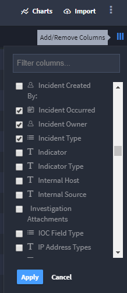

Customize the List of Records
=============================

Applications can have a large number of records. You can customize and
filter your view of records according to the tasks that you need to
complete.

When you first open the Default Report view of records, you'll see a
Keywords and Filter taskbar and a list of records below. The records are
initially listed only by Tracking ID. To adjust the columns visible,
click |image1| or **Add/Remove Columns.** (You'll find it on the
far-right of the Default Report page, above the list of records.)

|image2|

**Note:** For more information on using keywords searches and filtering
see, `Keyword Search and
Filter <../reports/keyword-search-and-filter.htm>`__.

The columns available for you to select vary depending on how the
application is built. Select the columns you want to view and click
**Apply.** You must have at least one column selected.

Within the list of records, you can:

+----------------------------------+----------------------------------+
| Action                           | How?                             |
+==================================+==================================+
| **Resize Columns**               | Drag the column border to the    |
|                                  | preferred size.                  |
+----------------------------------+----------------------------------+
| **Reorder Columns**              | Drag the column header and drop  |
|                                  | it to the desired location.      |
+----------------------------------+----------------------------------+
| **Sort Records by Column**       | Click the column header. Each    |
|                                  | column has three sort types,     |
|                                  | ascending, descending, and none. |
+----------------------------------+----------------------------------+
| **Load Additional Pages of       | Scroll to the bottom of the page |
| Records**                        | and click an additional page     |
|                                  | number.                          |
+----------------------------------+----------------------------------+
| **View or Edit an Individual     | Click the record row. The record |
| Record**                         | edit window opens.               |
+----------------------------------+----------------------------------+
| **Exit the Record Edit Window**  | Click outside of the edit        |
|                                  | window.                          |
+----------------------------------+----------------------------------+
| **View or Edit Multiple          | Click the checkbox just to the   |
| Records**                        | left of the record Tracking ID.  |
|                                  | Select as many records as you    |
|                                  | want to view or edit. For more   |
|                                  | information see `Bulk Modify     |
|                                  | Recor                            |
|                                  | ds <bulk-modify-records.htm>`__. |
+----------------------------------+----------------------------------+

You can save your customized view of records for further use. To save a
customized view, from the Default Report taskbar, select **Save Report**
and then, from the **Create new report** pull-down, select *Default*.
This saves your customized view as the default view of records you will
see when you access the records page. You could also save your
customized view as a new report, which you could then access as needed
from **Reports** on Swimlane's global navigation menu.

.. |image1| image:: ../../Resources/Images/column-view.png

