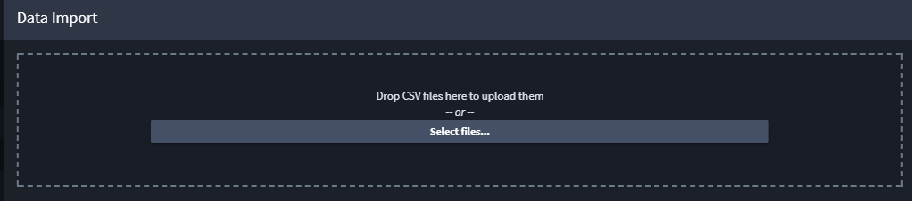

Import Record Data
==================

You can import data, as CSV files, into your Swimlane application.

To open the data import panel, click the button labeled **Import** from
the Default Report toolbar.

The Import Data window opens, where you can upload a CSV file by either
dragging it into the marked area, or clicking **Select File** and
selecting the file.

|image1|

Mapping Fields
--------------

After the file is selected, the system parses it by the column
delimiters.

On the Data Mapping tab, select a column and select the field from your
application that you want to map the data to.

Some field types can have additional options that can be specified, for
example:

-  Value List fields have an option to add missing values into the
   field's options.
-  User / Groups fields have an option to choose the name format of the
   data in the column. Test user field mapping by clicking the test
   mapping icon.
-  Date fields have an option to specify the date format of the data in
   the column.

Advanced Options
----------------

To configure advanced options, click **Advanced.** Then set the
following:

Creation Type
~~~~~~~~~~~~~

-  **Insert only:** only insert new record during import
-  **Insert and/or Update:** insert new and update existing records.
   Existing records are identified by the field selected in the Key
   Field dropdown. If a record with the same value for the key field as
   the CSV row that is currently processed exists, that record will be
   updated instead of creating a new one.

Error Handling
~~~~~~~~~~~~~~

If an error occurs while importing data from a column:

-  **Set as Empty:** the field mapped to that column will have empty
   value
-  **Skip Row:** the whole row will be skipped and no record will be
   created
-  **Stop Import:** importing the file will stop immediately and no
   further rows will be created

Header Row
~~~~~~~~~~

If the uploaded file doesn't have a row with column headings, toggle
this option and the columns in the Data Mapping tab will be marked as
"Column 1", "Column 2", etc.

To import the uploaded data, click **Run.** Import begins immediately in
a background process. To view the imported records, refresh the Default
Report page.

