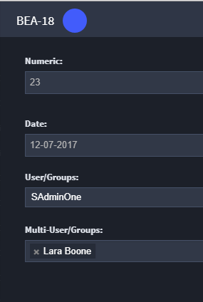
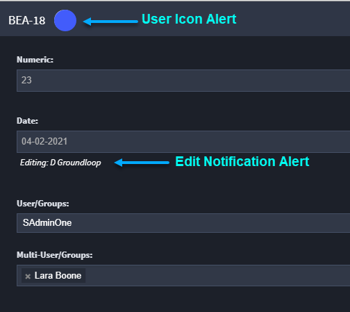

Coedit Records
==============

Multiple users can edit a record simultaneously. When you access a
record that someone else is also accessing, you will see their user
avatar immediately following the tracking ID of the record.

|image1|

As fields are modified, you will also receive immediate notification
below the modified field that data has changed, along with an alert of
who is making the changes.

|image2|

If you do not want other users to modify a record while you edit it, you
can set a lock on the record. See `Record Lock <lock-records.htm>`__ for
more information.

