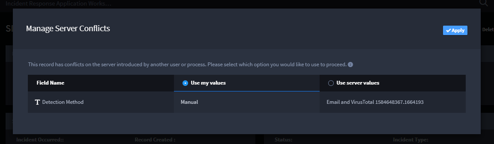

Manage Server Conflicts in Records
==================================

During a single editing session, you can reconcile the changes you are
making locally to those being updated from the server from a playbook
run. If there is a conflict of data, the Manage Server Conflicts dialog
opens.

|image1|

The Manage Server Conflicts dialog lists the affected field, and the
values from your local record edits and the values updated from the
server. Select the column of the value(s) you want to save to the record
and then click **Apply**.

To keep your changes and continue to edit the record, select and apply
**Use my values**. You will not be notified of additional updates to the
record on the server until after you save the record.

To accept the unsaved record update from the server, select and apply
**Use server values**. Your local changes will be overwritten by the
data from the server.

This dialog can appear frequently when you are editing records belonging
to a Swimlane application containing Trigger Integration workflow
actions where the option, Automatic Execution, is set to *True.*

You are also likely to receive this dialog when working with
applications with workflow Set Field Value actions, because in both of
these examples, workflow is changing the record both in the workflow and
in the application.

