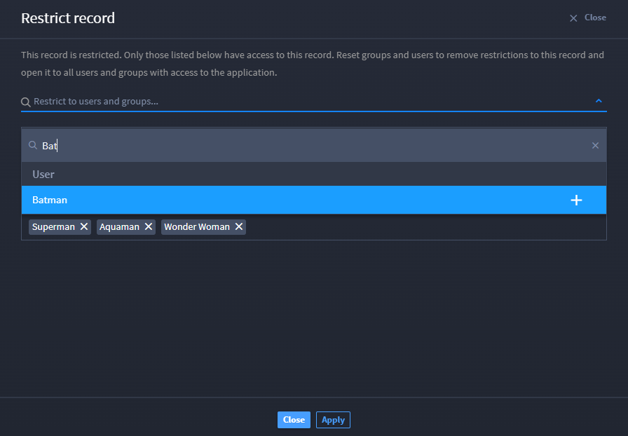
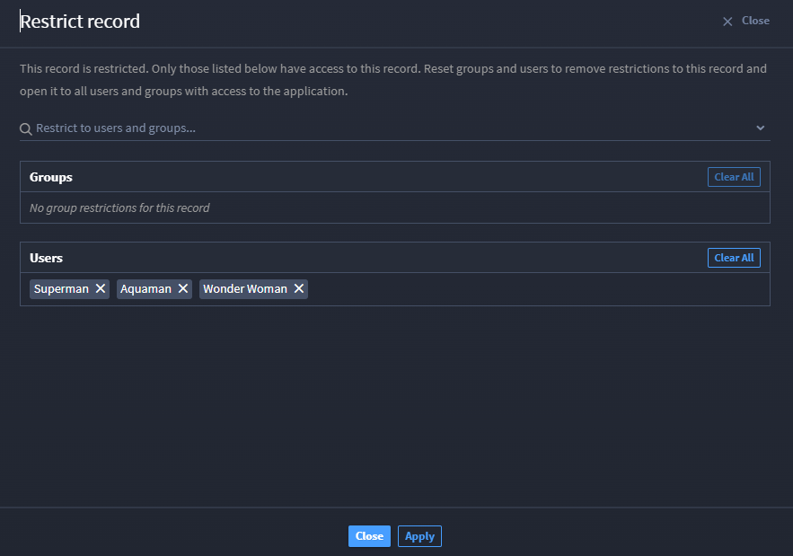

Restrict Records
================

You can restrict view access for a single record to specific users or
groups. By default, anyone with read permissions to the application's
records can view all records. To restrict records:

#. Open the record you want to restrict access to.

#. From the record header, access the record menu and select **Restrict
   Record.**

#. Select any combination of users or groups.

   |image1|

   Only individuals that fall within this selection will be able to
   access the record. Don't forget to add yourself or your user group!

#. Click **Add** for each user or group, and confirm your choices in the
   subsequent list.

   |image2|

#. When you're finished with your list of users and groups who can view
   the record, click the check mark to save your choices.

