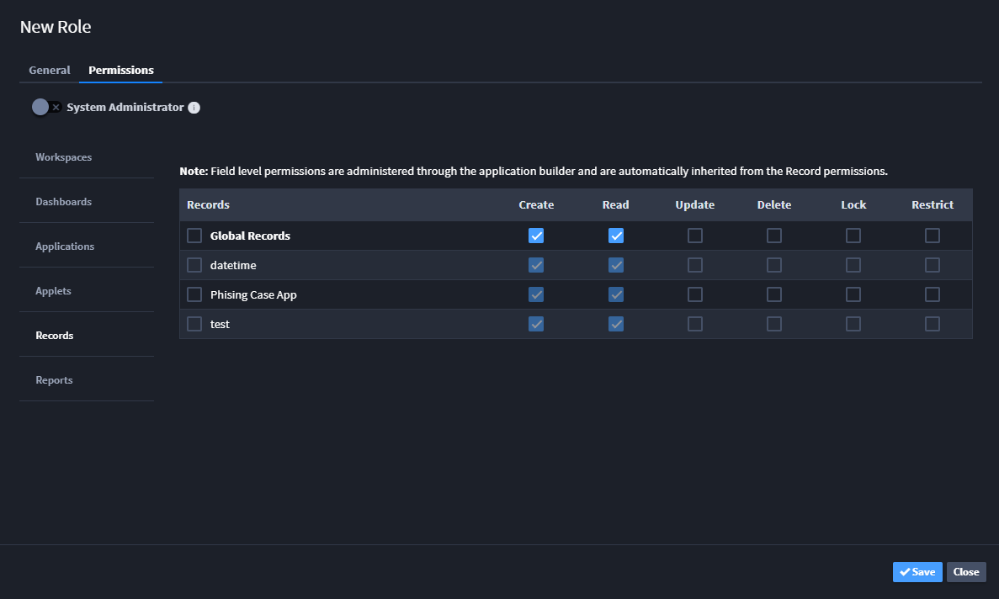
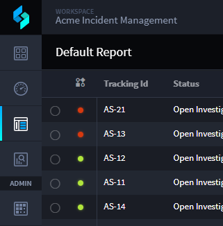
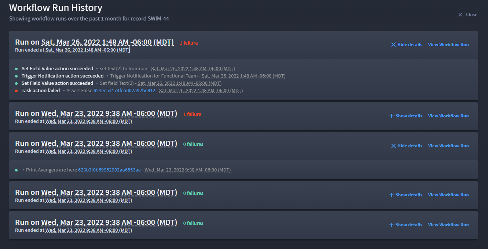
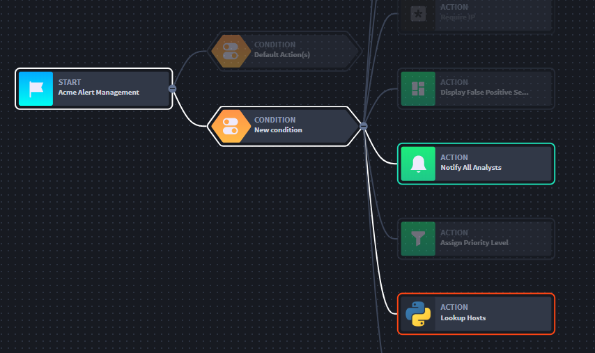
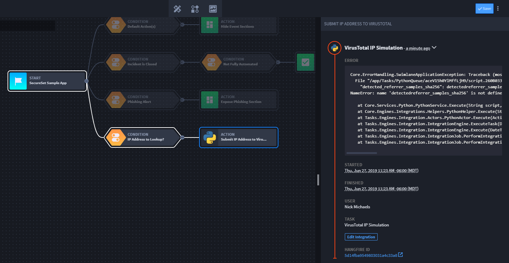

Records and Workflow
====================

Workflow conditions, repeats, and actions are executed in real-time as
you interact with records.

Activity on individual records catalyze workflow, for example:

-  You open a new record form.
-  A new record is saved for the first time.
-  An existing record is opened.
-  You modify an existing record.

In addition, workflow is also carried out when:

-  A new record is created by an integration task.
-  A new record is created by a remote client tool or script.
-  An existing record is modified by either of the previous two actions.

Workflow actions are applied with the following considerations:

-  Actions are executed in a one-pass system on each digest so as not to
   cause circular execution.
-  Set Field Value conditions will only execute the first time the
   condition is met. If the condition is invalidated and then
   revalidated it will execute again.
-  Notifications and exports are only executed on record save. This is
   to prevent flip-flop during editing causing multiple notifications
   that might not be valid.
-  Integrations can be optionally setup to execute in real-time or on
   record save.

Required Role-Based Access Control (RBAC) Settings
--------------------------------------------------

For non-administrator users who want to view workflow run history,
ensure that user is assigned a role that allows global record create and
read permissions. You set Global permissions from USERS, GROUPS & ROLES,
Roles.

|image1|

Next, ensure that you assign the role to have *Read* permissions to the
specific application and its workspace.

|image2|

View Workflow Run History
-------------------------

When working with the report view of records, you can view the current
status and the previous history of the associated workflow from the
workflow status indicator.

|image3|

The workflow status indicator column alerts you with whether the
workflow ran successfully or not. If you click the indicator, a dialog
opens that lists the history of the workflow run, tied to record
creation.

|image4|

Click **Show Details** on a workflow run to see more information on it,
whether it succeeded or it failed. You can click direct links to the
Hangfire Dashboard from the details. Use the information in Hangfire to
troubleshoot your failed workflows, as needed.

You can also view the direct workflow from the Workflow Run History
dialog. Click **View Workflow Run** to see the actual workflow progress.

|image5|

In the workflow view, Drill into the specific conditions and actions to
see additional processing information about the history of the
successful or failed workflow.

|image6|

.. |image2| image:: ../../Resources/Images/record-permissions.png

