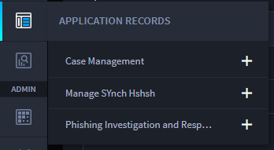
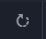

.. _records:

Application Records
===================

Records are the data from your Swimlane applications. They are made up
of various fields which are customizable, configurable, and built within
Swimlane's Application Builder.

The fields and options available in the record vary based upon how the
application is configured. Swimlane administrators control tasks related
to records for administrators and users, and can grant additional access
to users at the application, record, and field level. The listing of
records in Swimlane are considered Reports.

First, configure your workspace and dashboard to display records from
applications that you access frequently. You can then access them from
Swimlane's navigation bar.

To access records click the Application Records icon on the navigation
bar.

|image1|

Use the search filter on the Application Records menu to find a specific
application, as needed. The search filter will appear if you have more
than 6 applications associated to your workspace.

**Note:** If you don't see the application that you expect to be listed
in the navigation bar, verify that you have opened the correct workspace
and dashboard and have the proper permissions to view those records.
Additionally, you might need to load a different workspace.

When you select the name of the application, the Default Report view of
records opens.

If you have multiple users accessing records of a specific application,
utilize the refresh button at the bottom left of the Default Report
view.

|image2|

Within records, you manage and interact with data contained within the
platform, and you can perform the following tasks:

-  Add a New Record
-  Modify an Existing Record
-  Delete a Record
-  Restrict Access to a Record
-  Modify Bulk Records
-  Delete Bulk Records
-  View Record History
-  Share, Print or Export Records

.. toctree::
   :titlesonly:
   :caption: Children:

   /Content/user-guide/records/customize-the-list-of-records
   /Content/user-guide/records/search-record-data
   /Content/user-guide/records/modify-a-record/modify-a-record
   /Content/user-guide/records/bulk-modify-records
   /Content/user-guide/records/share-records
   /Content/user-guide/records/records-and-workflow
   /Content/user-guide/records/view-record-history
   /Content/user-guide/records/correlate-records
   /Content/user-guide/records/export-record-data
   /Content/user-guide/records/import-record-data
