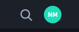
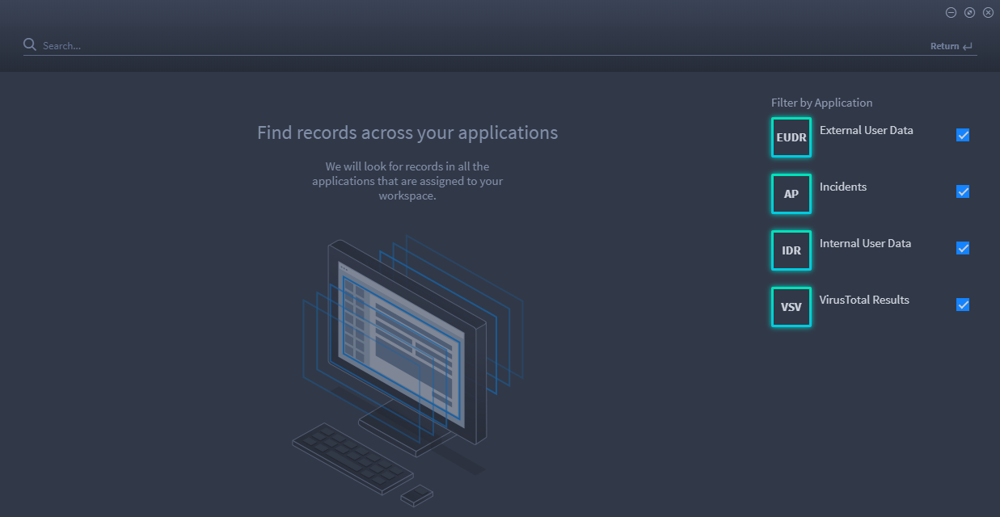
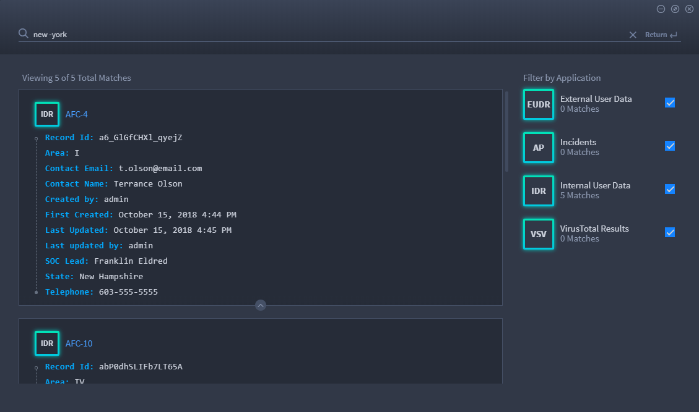
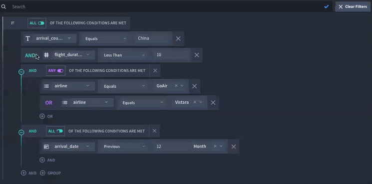
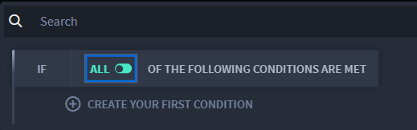
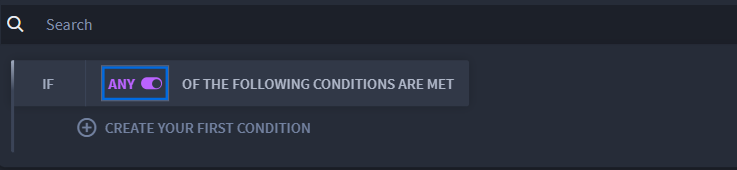
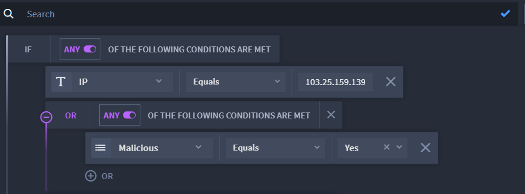

Search Record Data
==================

Use Swimlane's search feature to find specific text-based data or
keywords within records.

Search runs over the current workspace in Swimlane. To access search,
click the search icon on the workspace taskbar.

|image1|

Filter your search by the applications assigned to the current
workspace. You select or deselect applications to further filter the
search.

|image2|

Swimlane utilizes text-indexed search queries based on MongoDB text
search. The search logic is not case-specific. Search runs over text
fields, but not over numeric or date fields.

To search for exact phrases or keywords, enclose the phrase or keyword
in quotes, for example:

-  The IP address, ``"216.3.128.12"``
-  Tracking ID, ``"ABH-3549"``
-  ``"New Mexico"``

To exclude a word from the keyword search, prepend the word with the
hyphen "-" character. For example, if you want to find records that
contain the word "new" but not "New" as in "New York," you can search
for ``new -york``.

Most punctuation that you might use in your search is treated as a
delimiter. For example, searching for google.com will return results for
both "google" and "com", because the period is treated as a delimiter.
To search for an exact character sequence, enclose the keyword in
quotes.

The search results are displayed as matches, with the most relevant
match listed first in the window.

|image3|

Click the tracking ID of the record to open it.

**Note:** Although search runs over Comments fields, be aware that the
search window does not display the Comments field in the search results
window. You will need to open the record to view the contents of the
field.

The search window is adjustable. You can can manually resize and
minimize the window. If you click on a record to view it, the search
window automatically minimizes. The blue dot next to the search icon in
the navigation menu indicates that a search is still open. Click the
search icon again to reopen the search. To start a new search, delete
the search criteria and search again.

Build Filters in Record Search Queries
--------------------------------------

You can use both AND and ANY filters in a single filter now. This boosts
the capacity and strength of your search capabilities. Here's an example
of a query that contains multiple filters:

|image4|

| To build filters in record search queries:

#. Access the records you want to search by opening a report.

#. | Click within the Search field, and then select the start of your
     nested search filter. You can select either ALL of the conditions
     to be met, or ANY of the conditions to be met.
   | |image5|
   | |image6|
   | Next, you create your first condition.

#. | Continue to build your logic. In this example, the search is
     filtering for a specific IP address, and is also looking for any
     IP addresses marked "Malicious." 
   | |image7|

#. You can continue to build your search filter with criteria available
   within the application. The criteria can get as complex as you need
   it to be. You can filter on multiple fields and multiple values.

#. If you would like to save your filter to use again, click the blue
   checkmark in the search field. Your filter will be associated with
   the report when you access it again.

