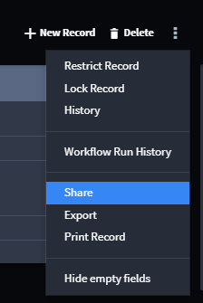

Share Records
=============

You can share a record with others.

To share a record:

#. Open the record in Swimlane.

#. Ensure that you are in the old view of the record.

You may have switched to the enhanced view of records, but sharing a
record has to be done in the old view, which is still accessible. With
the record open, click **Return to old view** at the bottom of your
screen.

|image1|

3. Access the ellipsis menu, and select **Share**.

   |image2|

4. On Share Records, you can enter Swimlane usernames and email
   addresses.

If you would also like the record to be sent to you, select the **Copy
me** box.

5. Add additional comments, and then click **Send**.

