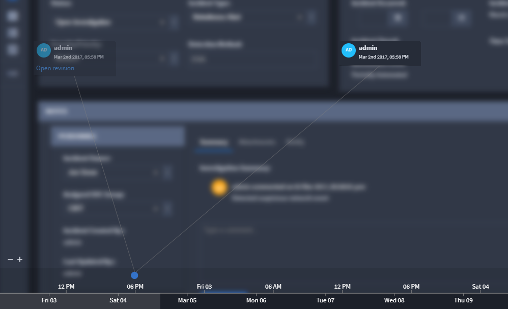
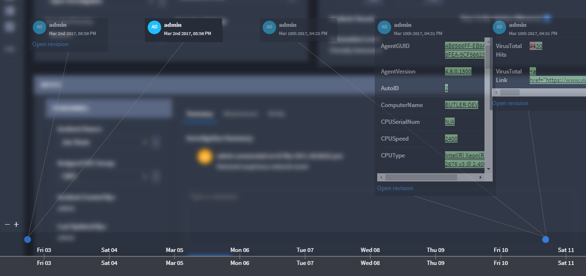

View Record History
===================

You can view the history of any record. Select a record, then from the
Record taskbar, pull down the Record menu and select **History.**

|image1|

This opens the Record History Timeline, where you can view:

-  Fields that have changed.
-  Previous and current values of changed fields.
-  Who initiated changes to the record and fields.

Modifications to the record are automatically captured, including:

-  Manual User Edits
-  Integration Record Modifications
-  Workflow Modifications
-  Bulk CSV Updates

You can adjust the timeline window to a larger or smaller time window.
Use the zoom in (**+**) and zoom out (**-**) icons.

|image2|

