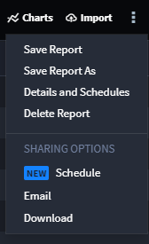
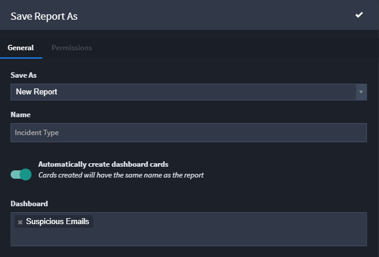
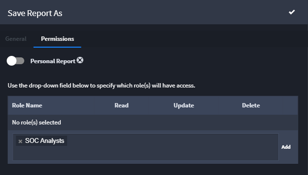
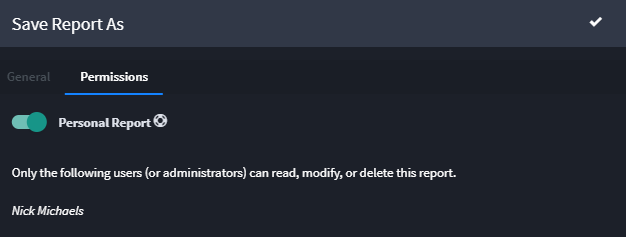
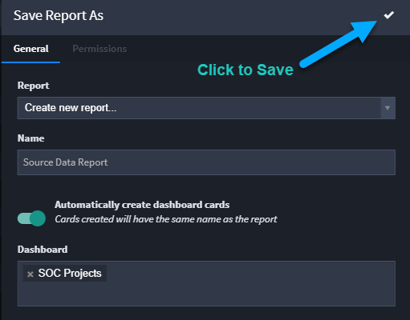
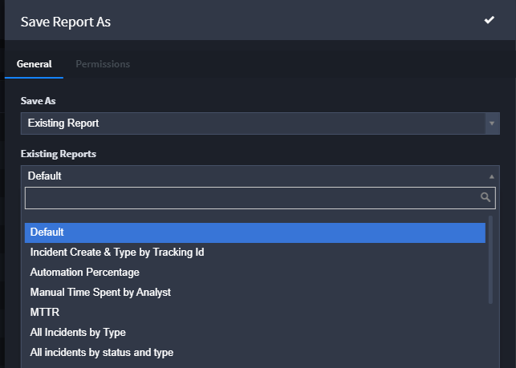

Create and Save Reports
=======================

The filters and records you view on the Default Report page can be saved
as reports. Add reports to a dashboard for quick access to analytics.
Report permissions allow you to share the reports you create with other
users.

To save edits to an existing a report, from the Report taskbar, click
the ellipsis menu icon and select **Save Report**.

|image1|

You'll receive a notification in the bottom right corner upon saving.

+> **Note:** Your ability to modify reports depends on permissions! You
will be able to edit and save existing reports if you have modify
permissions for reports. You will be able to create, edit, and save
reports if you have create permissions for reports.

+> **Note:** For more information on using keywords searches and
filtering see, `Keyword Search and
Filter <keyword-search-and-filter.htm>`__.

Creating a New Report
---------------------

#. Modify the viewable records with keywords, filters, columns, and
   sorting.

#. Once you are finished modifying your report, from the Report field
   select *Save Report As.*

#. On Save Report As, ensure that the **Save As** field says New Report,
   and then enter a title for the report in the **Name** field.

To add the report to an existing dashboard, select the **Automatically
Create Dashboard Cards** option and then indicate the target dashboard.

|image2|

4. Click the Permissions tab to set up or modify the permissions for
   accessing and modifying the report.

|image3|

If you have permissions to create a personal report (i.e. a report that
will only be visible to you), enable the Personal Report toggle. (If you
do not have permissions, you will not be able to move the toggle.)

|image4|

5. Click the white checkmark on the open Save Report As window to save
   the report.

|image5|

Save a Default View of Records
------------------------------

When you first create a series of records, the view of the Records page
lists all the records created so far. This is the Default Report of your
records. You can change this default view.

To save a default view of records:

#. Use filters and column view settings to customize the view according
   to your preferences.

#. From the Default Report taskbar, select **Save Report As.**

#. On Save Report As, select *Existing Report* from the **Save As**
   drop-down field.

Swimlane displays all of the existing reports related to your
application.

4. Under Existing Reports, select *Default*.

|image6|

5. Click the white checkmark on the open Save Report As window to save
   the default view of the report.

Report Widgets
--------------

You can set up report widgets from within Charts. From the Default
Report records view, click **Charts,** then from Chart Options, select
**Widgets.**

Report widgets have access to the report's data, in two different
formats: raw (as it is received from the API), and a more user friendly
format where the ID's are replaced with values. In addition to the
report's data, the widget also has access to the query.

For more detail on setting up report widgets, see `Report
Widgets <../../administrator-guide/widgets/report-widgets.htm>`__ in the
Swimlane Developer Guide.

