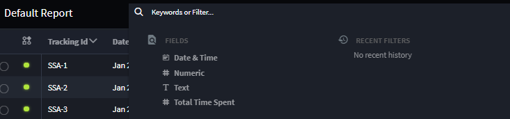
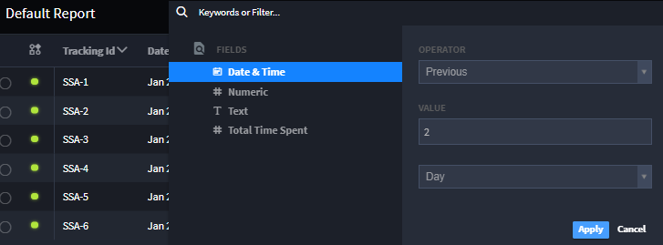
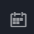

Keyword Search and Filter
=========================

The keyword searching and filtering feature is located in the header of
saved reports and the Default Report page. It allows you to sort through
information in records based on the types of fields included in the
application. These main field types are text, numeric, date & time,
selection, and user/group.

Use Keyword Search and Filter
-----------------------------

#. Click in the search field at the top of the report page.

|image1|

2. To begin searching, either type information you are searching for or
   select a field to filter by.

+> **Note:** When searching or filtering in the Text List Field, if
after clicking **Apply** the results display *No Value* in the search
bar, press the Enter/Return key after inserting the search or filter
phrase before clicking the **Apply** button.

3. Select your operator and insert the value you are filtering by. Click
   apply. For more information on operators and values, reference
   Filtering Field Types below.

   |image2|

   The report is now sorted. The filter will appear at the top of the
   page in the search field.

   +> **Note:** To view the information contained in each record, click
   |image3| or **Add/Remove Columns**, on the report header. This allows
   you to add or remove columns of content.

   +> **Note:** When you save the selected records on the Default
   Reports page as a report, you also save any filters applied.

Filter Field Types
------------------

When filtering reports, each section in the record appears and can be
filtered individually. These main field types are text, numeric, date &
time, selection, and user/group.

Text
~~~~

Text filters are indicated by the |image4| symbol and only apply to
sections that allow text entries.

============== =========================================================
Operator       Description
============== =========================================================
Equals         Shows records that contain the exact filter entry.
Does Not Equal Shows records that do not contain the exact filter entry.
Contains       Shows records that include the filter entry.
Excludes       Shows records that do not contain the filter entry.
============== =========================================================

Numeric
~~~~~~~

Numeric filters are indicated by the |image5| symbol and only apply to
sections that allow numeric entries.

+-----------------------+---------------------------------------------+
| Operator              | Description                                 |
+=======================+=============================================+
| Equals                | Shows records that contain the exact filter |
|                       | entry.                                      |
+-----------------------+---------------------------------------------+
| Does Not Equal        | Shows records that do not contain the exact |
|                       | filter entry.                               |
+-----------------------+---------------------------------------------+
| Contains              | Shows records that include the filter       |
|                       | entry.                                      |
+-----------------------+---------------------------------------------+
| Excludes              | Shows records that do not contain the       |
|                       | filter entry.                               |
+-----------------------+---------------------------------------------+
| Less Than             | Shows records that includes numbers smaller |
|                       | than the number entered.                    |
+-----------------------+---------------------------------------------+
| Less Than or Equal    | Shows records that includes numbers smaller |
|                       | than or the same as the number entered.     |
+-----------------------+---------------------------------------------+
| Greater Than          | Shows records that include numbers larger   |
|                       | than the number entered.                    |
+-----------------------+---------------------------------------------+
| Greater Than or Equal | Shows records that include numbers larger   |
|                       | than or the same as the number entered.     |
+-----------------------+---------------------------------------------+

Date & Time
~~~~~~~~~~~

Date & Time filters are indicated by the |image6| symbol and only apply
to sections that allow date entries.

+-----------------------+---------------------------------------------+
| Operator              | Description                                 |
+=======================+=============================================+
| Equals                | Shows records that contain the exact filter |
|                       | entry.                                      |
+-----------------------+---------------------------------------------+
| Does Not Equal        | Shows records that do not contain the exact |
|                       | filter entry.                               |
+-----------------------+---------------------------------------------+
| Less Than             | Shows records that include dates and times  |
|                       | prior to the date and time entered.         |
+-----------------------+---------------------------------------------+
| Less Than or Equal    | Shows records that include dates and times  |
|                       | prior to or the same as the date and time   |
|                       | entered.                                    |
+-----------------------+---------------------------------------------+
| Greater Than          | Shows records that include dates and times  |
|                       | later than the date and time entered.       |
+-----------------------+---------------------------------------------+
| Greater Than or Equal | Shows records that include dates and times  |
|                       | later than or the same as the date and time |
|                       | entered.                                    |
+-----------------------+---------------------------------------------+
| Previous              | Shows records that include dates and times  |
|                       | prior to the date included. The value       |
|                       | entered with this operator determines the   |
|                       | number of time values prior to the date     |
|                       | entered, such as 2 minutes, 1 day, or 7     |
|                       | months.                                     |
+-----------------------+---------------------------------------------+
| Current               | Shows records that include the same date    |
|                       | and time as the date and time entered. The  |
|                       | value selected with this operator           |
|                       | determines the time value to sort by, such  |
|                       | as minute, day, and month.                  |
+-----------------------+---------------------------------------------+

Selection
~~~~~~~~~

Selection filters are indicated by the |image7| symbol and only apply to
sections that allow date entries.

============== =========================================================
Operator       Description
============== =========================================================
Equals         Shows records that contain the exact filter entry.
Does Not Equal Shows records that do not contain the exact filter entry.
Contains       Shows records that include the filter entry.
Excludes       Shows records that do not contain the filter entry.
============== =========================================================

User/Group
~~~~~~~~~~

User/Group filters are indicated by the |image8| symbol and only apply
to the following operators.

+----------------+----------------------------------------------------+
| Operator       | Description                                        |
+================+====================================================+
| Equals         | Shows records that contain the exact user or group |
|                | filter entry.                                      |
+----------------+----------------------------------------------------+
| Does Not Equal | Shows records that do not contain the exact user   |
|                | or group filter entry.                             |
+----------------+----------------------------------------------------+
| Contains       | Shows records that include the user or group       |
|                | filter entry.                                      |
+----------------+----------------------------------------------------+
| Excludes       | Shows records that do not contain the user or      |
|                | group filter entry.                                |
+----------------+----------------------------------------------------+

