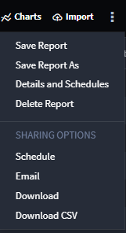

Share Reports
=============

You can share reports by scheduling an email to be sent, sending an
email now, or downloading a PDF of the report. To find these sharing
options, from within the open report, click the ellipsis on the report
header and select **Schedule**, **Email**, or **Download** under Sharing
Options.

|image1|

.. toctree::
   :titlesonly:
   :caption: Children:

   /Content/user-guide/reports/share-reports/share-reports-by-schedule
   /Content/user-guide/reports/share-reports/share-reports-by-email
   /Content/user-guide/reports/share-reports/download-reports
