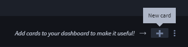
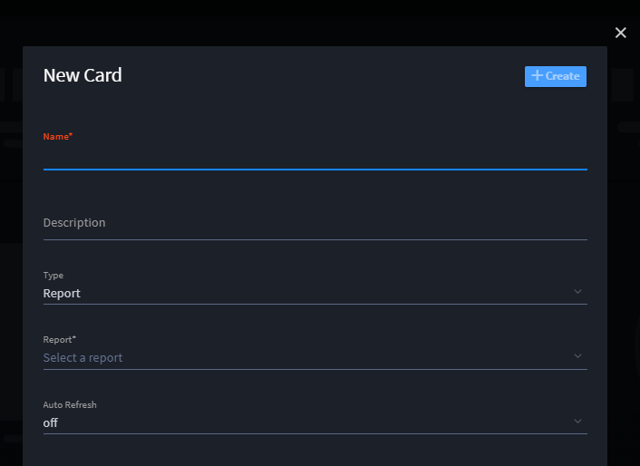
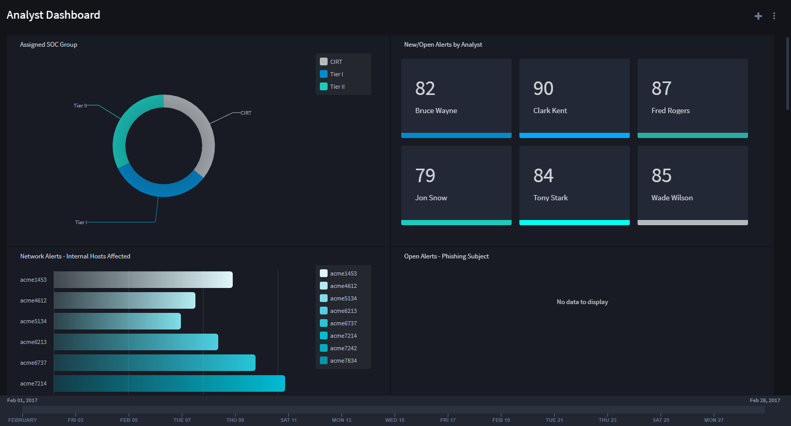
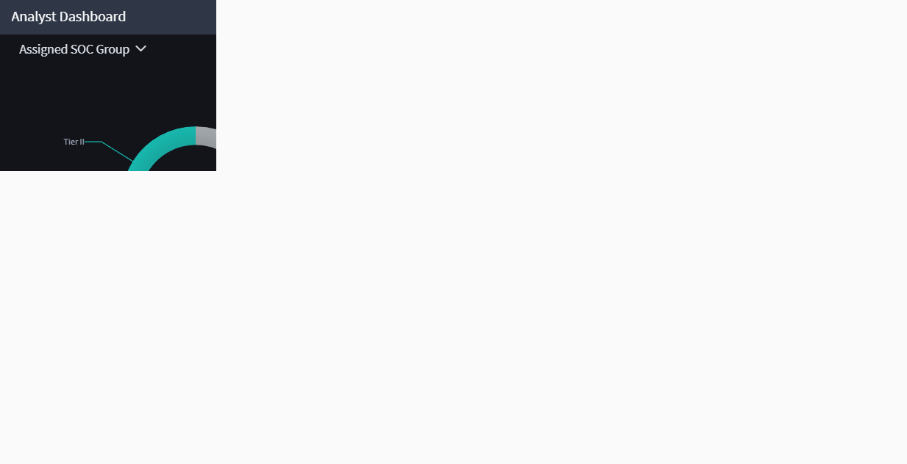
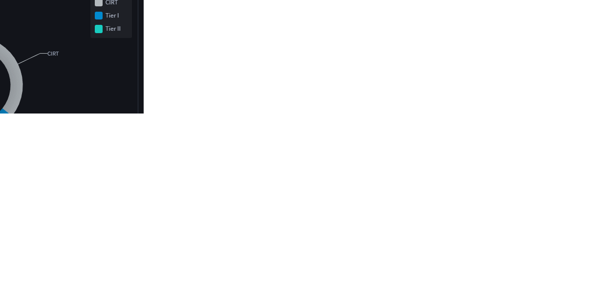
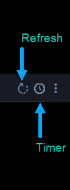
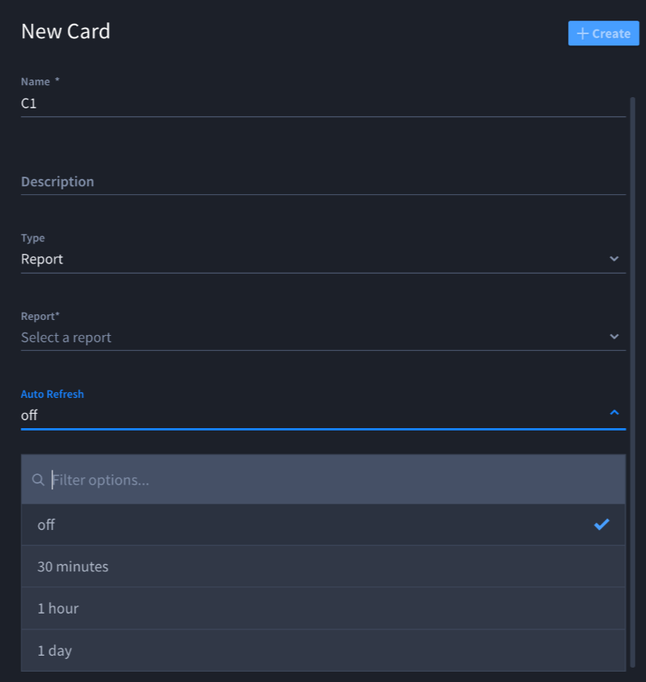

Create or Edit Cards
====================

Cards display reports, usage statistics, or HTML. Cards are completely
customizable and can be resized and rearranged on dashboards by
administrators and users with proper access.

Click within a card to view a report that lists the records associated
with that card, or click on a data point within a chart to view a
filtered list of records corresponding to that data. A variety of chart
types is available to display record information in meaningful ways,
making dashboards powerful tools to find records quickly.

Create New Cards
----------------

To create or edit new cards:

#. From the Dashboard taskbar menu, select **New Card.**

   |image1|

#. On New Card, provide a name and description for the card.

   |image2|

#. Select **Type** and specify whether the card will display a report,
   HTML, or a usage statistic.

4. If you want the data displayed in the card to refresh consistently at
   a specific time increment, specify the time increment on **Auto
   Refresh**.

5. Once you've completed all the necessary fields for your card, click
   **Save.**

Modify Cards on a Dashboard
---------------------------

Once a card is created, it is inserted into the dashboard. Every new
card added to a dashboard will be inserted as the first card in the top
left corner of the dashboard.

|image3|

Cards can be resized and repositioned on the dashboard. To reposition a
card, click and drag the heading area of the card, and drop it in the
desired location.

|image4|

To resize a card, hover over the card and click and drag the resize
element that will appear in the bottom right corner of the card.

|image5|

From the Card you can click the ellipsis submenu to open the
card-specific dropdown menu. From this menu you can select from the
following:

-  **Display in Search:** open the report shown on the card in the
   search page
-  **Edit Card:** edit the card details
-  **Remove card:** remove the card from the dashboard

Refresh Card Display
~~~~~~~~~~~~~~~~~~~~

You can refresh reports and usage statistics in cards. To refresh the
data, click the **Refresh** icon.

|image6|

If you want the data displayed in the card to automatically refresh at a
specific time increment, specify the time increment on the **Timer**
icon. The Auto-refresh timer on dashboards can now be set to intervals
>=30 minutes.

This setting is also available within the card editor.

|image7|

