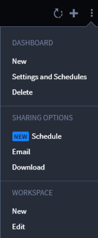
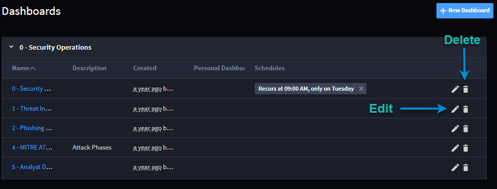

Create or Edit User Dashboards
==============================

A Swimlane dashboard is a visual display of records, reports, and charts
associated with the applications in the workspace. The dashboard
consists of cards. A workspace can have multiple dashboards.

Creating a New User Dashboard
-----------------------------

To create a new dashboard:

#. From the Dashboard taskbar menu, select **New.
   **

2. On New Dashboard, enter the name, description and associated
   workspaces. The current workspace is selected by default.

3. | Click the Advanced tab. To indicate whether you want the dashboard
     to record a timeline, enable or disable the timeline switch.
   | |image1|

4. | Click the Permissions tab. Specify whether the dashboard is a
     personal dashboard, or to specify other role-based permissions.
   | |image2|

Editing or Deleting a User Dashboard
------------------------------------

To edit or delete a dashboard:

From the Dashboards taskbar menu, select **Edit** or **Delete.**

|image3|

You can also edit or delete a dashboard from the Dashboard page. Click
the pencil or the trash can icon.

|image4|

.. |image1| image:: ../../Resources/Images/dashboard-advanced.png
.. |image2| image:: ../../Resources/Images/personal-dashboard.png

