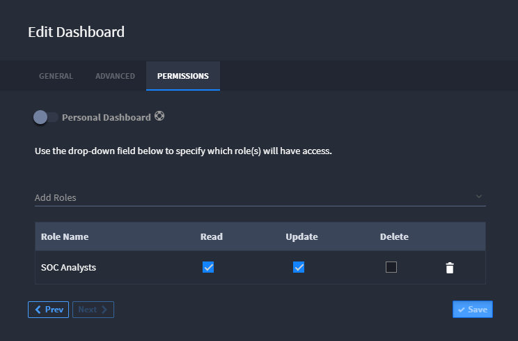

Set Dashboard Permissions
=========================

To modify the dashboard permissions, from the Create or Edit Dashboard
dialog, click the Permissions tab. Dashboards can be accessible
personally or through role-based access control.

|image1|

You can also set up private dashboards. Private dashboards allow
end-users to create personal dashboards that only they can view and
manage.

