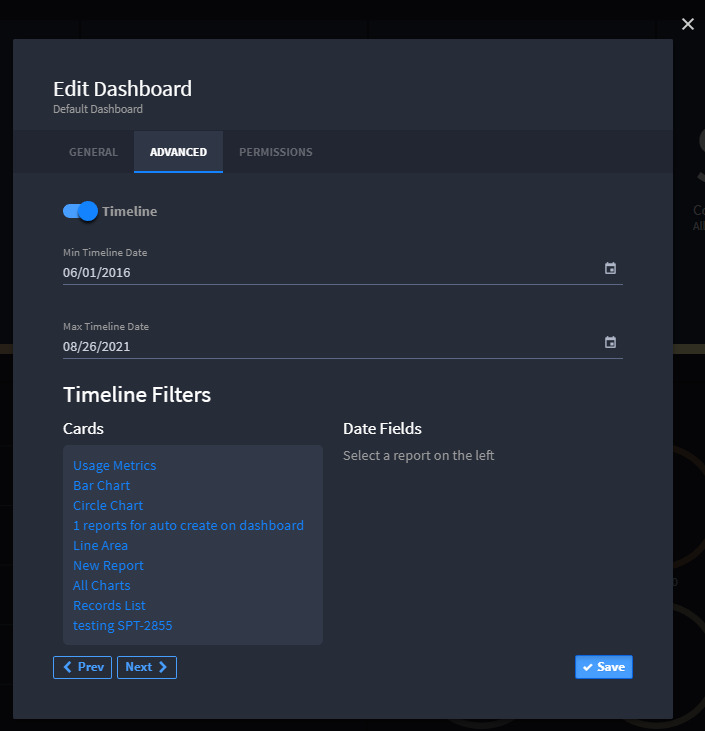

Timeline Filter
===============

After one or more cards have been added to a dashboard, you can also add
a timeline filter to affect all or some of the charts and reports
displayed.

To add a timeline filter:

#. From the Dashboard taskbar, access the menu and select **Edit
   Dashboard.
   **

2. | On Edit Dashboard, click the Advanced tab and toggle the Timeline
     option.
   | |image1|

3. After saving the dashboard, the timeline filter appears at the bottom
   of the page.

