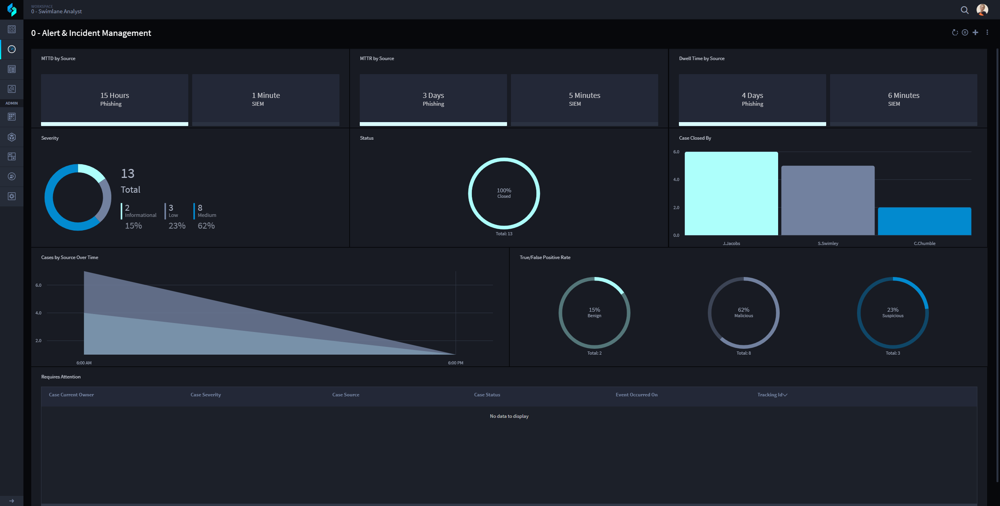
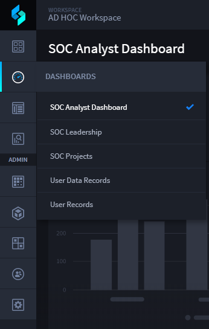
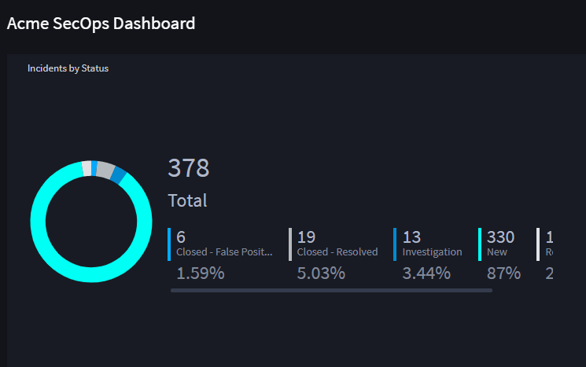

Workspaces and Dashboards
=========================

Users manage Swimlane by working with records on workspaces, dashboards,
and cards.

Workspaces
----------

Workspaces are customizable areas within the Swimlane platform where you
can organize and access the Swimlane tools and features that you use on
a regular basis. Workspaces can include applications, dashboards,
records, reports, and charts. Administrators can change the default
workspace and dashboards for users. All users can switch to different
workspaces and dashboards according to the permissions that they have
set.

|image1|

Dashboards
----------

Dashboards are a visual display of records, reports, and charts
associated with the applications in the workspace. A workspace can have
multiple dashboards, and users can view different dashboards by
selecting the Change Dashboard/Workspace icon and choosing another
dashboard from the list. Users only have access to see workspaces,
dashboards, records, and reports if they are given access by an
administrator. If an existing dashboard or report is not visible, an
administrator should check that the user has been assigned proper
permissions.

|image2|

Cards
-----

A report or an html object that is associated with a dashboard. You can
have multiple cards on a single dashboard. Cards are completely
customizable and can be resized and rearranged on the dashboard by
administrators or users with proper access. Users can click within a
card to view a list of the records associated with that chart or report,
or click on a data point within a chart to view a filtered list of
records corresponding to that data. A variety of different chart types
are available to display record information in meaningful ways, making
dashboards, cards, and charts powerful tools to find records quickly and
visualize data.

|image3|

.. toctree::
   :titlesonly:
   :caption: Children:

   /Content/user-guide/workspaces-and-dashboards/navigate-workspaces-and-dashboards
   /Content/user-guide/workspaces-and-dashboards/create-or-edit-user-dashboards
   /Content/user-guide/workspaces-and-dashboards/set-dashboard-permissions
   /Content/user-guide/workspaces-and-dashboards/create-or-edit-cards
