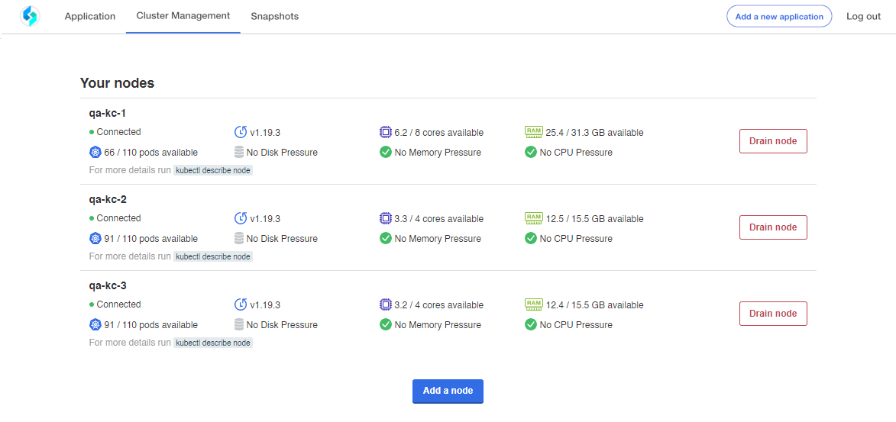
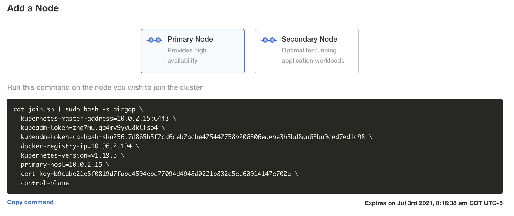

Add Additional Nodes to Create an HA Cluster
============================================

**Important!** This topic provides instructions on how to create a High
Availability (HA) cluster and assumes you have already run the Turbine
Platform Installer on the first node. Please see `Install Into an
Embedded Kubernetes
Cluster <install-turbine-on-an-embedded-kubernetes-cluster.htm>`__ if
you have not yet installed on the first node.

HA considerations
~~~~~~~~~~~~~~~~~

-  HA clusters require at least 3 nodes and the total number of nodes
   must be an odd number.
-  Only one MongoDB pod can run on a node. For example, you need 3 nodes
   in a cluster if you want to go to 3 MongoDB pods to enable a replica
   set.
-  The first node that the initial install is running on should be in
   the target group to start. The additional nodes should only be added
   to the target groups after they’ve been joined to the cluster.

To add additional nodes to a cluster:

#. From the Turbine Platform Installer UI, click the Cluster Management
   tab.

|image1|

The Cluster Management page displays your installed nodes.

2. Click **Add a node**.

3. Under Add a Node, ensure that you have selected **Master Node** and
   then click **Copy command**.

|image2|

**Important!** The code generated here expires after time. Swimlane
recommends that you always copy the code as you work to add additional
nodes. Do not save the code for use later.

4. Go to your Command-Line Interface (CLI) and paste the copied command
   for your additional nodes.

5. Back in the Turbine Platform Installer UI, click the Application tab,
   and then click **Config**.

6. Scroll down to the heading **HA Settings**. Select **HA Environment**
   and click **Save config**.

7. Once you save the new configuration, you are prompted to view the new
   version. Click **Go to new version**.

8. On Version History, click **Deploy**.

9.  Return to the Application tab. Once the Application Status is
    *Ready* you have added the additional nodes to your HA Turbine
    environment.

10. Add the new nodes to the load balancer target groups.

