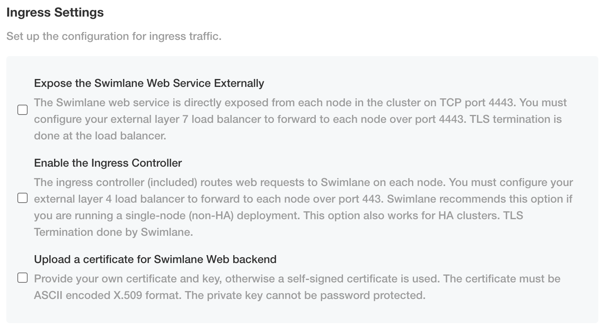
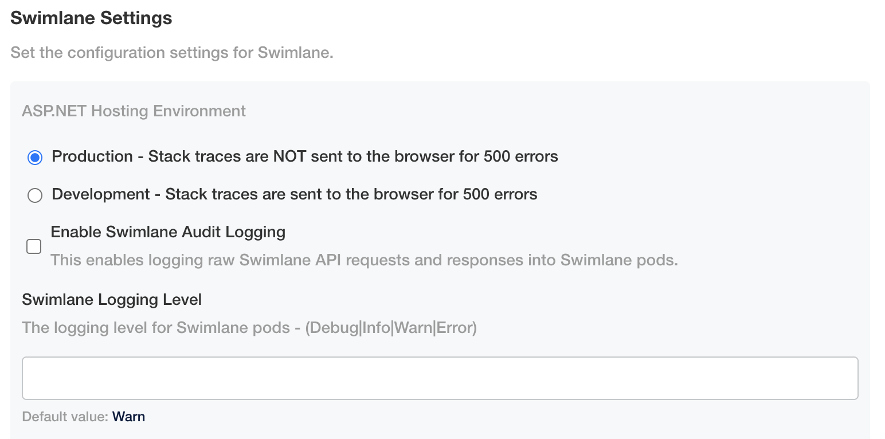
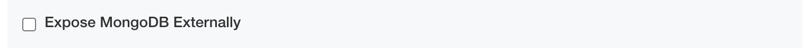
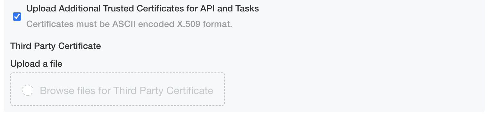
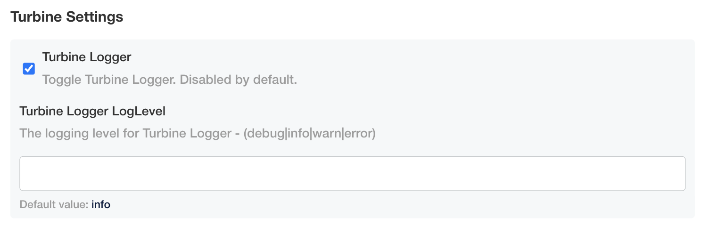

Configure the Turbine Platform for an Embedded Cluster Install
==============================================================

When you need to access the TPI UI after the initial install you can
access it by access port 8800 over HTTPS on any node IP (e.g.
https://:8800).

**Note:** All configuration of the Turbine Platform Installer and
Turbine platform must be done through the TPI admin console config page.
Editing or manipulating the underlying Kubernetes resources is not
supported and will not be permanent since they are managed and
controlled by the Turbine Platform Installer.

#. On Swimlane Settings, you'll begin setting up your configuration for
   Turbine. Review and set the following fields as necessary:

   -  **Expose the Swimlane Web Service Externally?** - Enable this
      option when using a Layer 7 load balancer. The Swimlane web
      service will be directly exposed from each node in the cluster on
      TCP port 4443.
   -  **Enable the Ingress Controller** - Enable this option when using
      a Layer 4 load balancer or for single node lab/test environments.
      The included ingress controller will be used for routing web
      requests to Swimlane on TCP port 443.

      -  **Swimlane Hostname** - The DNS record pointing to the Turbine
         Platform Installer and Turbine platform load balancer.
      -  **Upload a certificate for Swimlane Web?** - Enable this option
         to upload a certificate and key to be used for the included
         ingress controller. If no certificate is uploaded a self-signed
         one will be generated and used. The certificate must be ASCII
         encoded X.509 format. The private key cannot be password
         protected.

   -  **Upload a certificate for Swimlane Web backend?** - Enable this
      option to upload a certificate and key to be used by the backend
      Swimlane web service. If no certificate is uploaded a self-signed
      one will be used.

|image1|

2. Next, set the Swimlane settings.

   -  **ASP.NET Hosting Environment** - Set this option to Development
      to have stack traces sent to the browser for 500 errors. Set this
      option to Production to not send them.

   -  **Enable Swimlane Audit Logging** - Enable this option to log raw
      Swimlane API requests and responses into Swimlane pods.

   -  **Swimlane Logging Level** - Set this option to specify the
      logging level for Swimlane pods.

|image2|

3. Next, determine whether to override the OpenSSL settings for
   CipherString and MinProtocol for outgoing secure connections that
   originate from API and Tasks pods.
4. Next, determine whether you want to enable OpenTelemetry collector
   and connect it to Elastic APM.

5. Determine whether you want MongoDB to be exposed for external access.

   -  **Expose MongoDB Externally** - Enable this option to expose each
      MongoDB pod as a NodePort from each node in the cluster. Each one
      will use a random port in your cluster's NodePort range.

   |image3|

6. If you have third-party certificates for API and tasks, click
   **Upload Additional Trusted Certificates for API and Tasks** and then
   browse for and upload your certificates.

   -  **Upload Additional Trusted Certificates for API and Tasks**

   |image4|

7. Next, set the Turbine settings.

   -  **Enable the Turbine Logger** - Enable this option to log messages
      coming from all agents and reoutput them in a central location

      |image5|

9. Next, choose whether to enable or disable a pod liveness probe for
   the API and Tasks pods. The default liveness probe setting for API
   pods is disabled and for Tasks pods is enabled.

10. On Initial MongoDB Settings, enter the Mongo encryption keys and
    administrative passwords for MongoDB.

11. Next, if you have 3 or more nodes in your cluster, click **HA
    Environment** and set the number of pods for each type.

12. If you have an HA cluster, confirm the recommended default settings
    for Swimlane Web/API/Tasks/Reports and Turbine
    API/Engine/Agent/WebhookAgent/Websocket Relay AntiAffinity (Soft)
    and MongoDB and RabbitMQ Pod AntiAffinity (Hard). Then, click **Save
    config**.

13. When you save the configuration, preflight checks for your
    installation begin.

14. Once the preflight checks process, the Turbine Platform Installer
    Admin Console opens.

15. Once the status of your application says *Ready*, you have a
    successful installation of Turbine.

