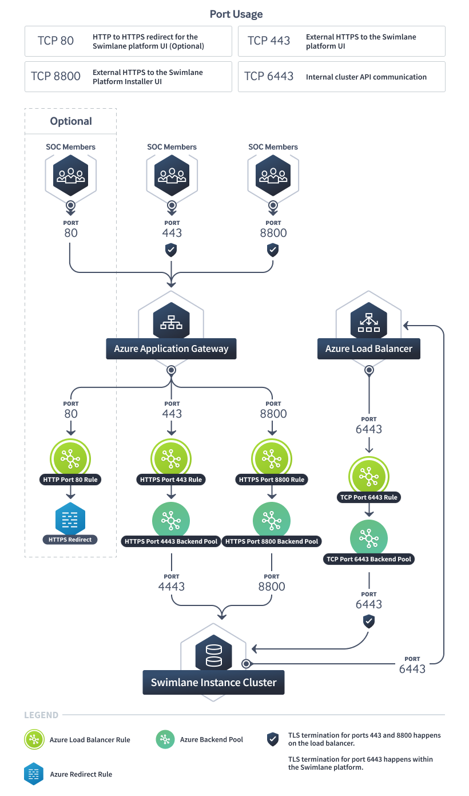

Azure Standard_v2 Application Gateway
=====================================

This topic explains how to use an Azure Standard_v2 Application Gateway
(Layer 7) for your Turbine deployment. Two load balancers are required
for this deployment. The Azure Standard_v2 Application Gateway (Layer 7)
is used for external access to the Turbine platform and the Turbine
Platform Installer. An additional Azure Load Balancer (Layer 4) is still
required for the internal cluster communication.

Architecture Diagram
--------------------

|image1|

Standard_v2 Application Gateway for the Turbine Platform and the Turbine Platform Installer
-------------------------------------------------------------------------------------------

-  Create an `Azure Standard_v2 Application
   Gateway <https://docs.microsoft.com/en-us/azure/application-gateway/quick-create-portal>`__

   -  ``Resource Group`` should be set according to your organization's
      standards
   -  ``Region`` should match that of the Virtual Machines that Turbine
      will be installed in
   -  ``Tier`` set to ``Standard V2``
   -  ``Enable Autoscaling`` should be set according to your
      organization's standards
   -  ``Availability Zone`` set to select all zones that will have
      virtual machines that Turbine will be installed on.
   -  ``Virtual Network`` should be set according to your organization's
      standards

      -  The virtual network that the Application Gateway is in needs to
         be able to communicate to the virtual network that the Turbine
         virtual machines are in

   -  ``Frontend IP Address Type`` should be set according to your
      organization's standards

Backend Pools
-------------

-  Create the following Backend Pools:

   -  Port 443

      -  Add the IP of each virtual machine that Turbine will be
         installed on

   -  Port 8800

      -  Add the IP of each virtual machine that Turbine will be
         installed on

Routing Rules
-------------

-  Create the following Routing Rules:

   -  Port 443

      -  ``Frontend IP`` set to the IP that was selected above
      -  ``Protocol`` set to ``HTTPS``
      -  ``Port`` set to ``443``
      -  ``Listener Type`` set to ``Basic``
      -  ``Backend Targets``

         -  ``Target Type`` set to ``Backend Pool``
         -  ``Backend Target`` set to the ``Port 443`` backend pool
            created above

      -  ``HTTP Settings``

         -  ``Backend Protocol`` set to ``HTTPS``
         -  ``Backend Port`` set to ``4443``

            -  Note that this is ``4443`` and not ``443``

         -  ``Trusted Root Certificate``

            -  ``Use Well Known CA Certificate``

               -  If your certificates are signed by a well-known CA you
                  can set this to ``Yes``
               -  If you're using a private or untrusted CA then set
                  this to ``No`` and set ``CER Certificate`` to the root
                  CA certificate of the certificate uploaded for the
                  Turbine Web backend on the Turbine Platform Installer
                  config page
               -  More information on how to export this certificate in
                  the right format can be found in Azure's `Certificates
                  for Backend
                  Authentication <https://docs.microsoft.com/en-us/azure/application-gateway/certificates-for-backend-authentication#export-trusted-root-certificate-for-v2-sku>`__
                  documentation

         -  ``Request time-out`` may vary based on your preferences for
            how long the load balancer will wait for a request from the
            backend before returning a "connection timed out" error
            message
         -  ``Override with new host name`` set to ``Yes``
         -  ``Host Name Override`` set to
            ``Override with specific domain name``

            -  Set the host name override field to the hostname of the
               certificate uploaded for the Turbine Web backend on the
               Turbine Platform Installer config page

         -  ``Create custom probes`` set to ``No``

   -  Port 8800

      -  ``Frontend IP`` set to the IP that was selected above
      -  ``Protocol`` set to ``HTTPS``
      -  ``Port`` set to ``8800``
      -  ``Listener Type`` set to ``Basic``
      -  ``Backend Targets``

         -  ``Target Type`` set to ``Backend Pool``
         -  ``Backend Target`` set to the ``Port 800`` backend pool
            created above

      -  ``HTTP Settings``

         -  ``Backend Protocol`` set to ``HTTPS``
         -  ``Backend Port`` set to ``8800``
         -  ``Trusted Root Certificate``

            -  ``Use Well Known CA Certificate``

               -  If your certificates are signed by a well-known CA you
                  can set this to ``Yes``
               -  If you're using a private or untrusted CA then set
                  this to ``No`` and set ``CER Certificate`` to the root
                  CA certificate of the certificate uploaded for the
                  Turbine Platform Installer UI
               -  More information on how to export this certificate in
                  the right format can be found in Azure's `Certificates
                  for Backend
                  Authentication <https://docs.microsoft.com/en-us/azure/application-gateway/certificates-for-backend-authentication#export-trusted-root-certificate-for-v2-sku>`__
                  documentation

         -  ``Request time-out`` may vary based on your preferences for
            how long the load balancer will wait for a request from the
            backend before returning a "connection timed out" error
            message
         -  ``Override with new host name`` set to ``Yes``
         -  ``Host Name Override`` set to
            ``Override with specific domain name``

            -  Set the host name override field to the hostname of the
               certificate uploaded for the Turbine Platform Installer
               UI

         -  ``Create custom probes`` set to ``No``

   -  Optional - Port 80

      -  Used for the HTTP to HTTPS redirect and can be excluded if you
         only want HTTPS/443 to be available
      -  ``Frontend IP`` set to the IP that was selected above
      -  ``Protocol`` set to ``HTTP``
      -  ``Port`` set to ``80``
      -  ``Listener Type`` set to ``Basic``
      -  ``Backend Targets``

         -  ``Target Type`` set to ``Redirection``
         -  ``Redirection Type`` set to ``Permanent``
         -  ``Redirection Target`` set to ``Listener``
         -  ``Target Listener`` set to the ``Port 443`` listener created
            above
         -  ``Include Query String`` set to ``Yes``
         -  ``Include Path`` set to ``Yes``

Network Security Groups
-----------------------

For Azure Standard v2 Application Gateways, ingress port access is
defined in the network security groups used by the subnets. The port
requirements are available in System Requirements, `External
Access <../system-requirements-for-an-embedded-cluster-install/system-requirements-for-an-embedded-cluster-install.htm#External>`__.
Azure requires special ports to be open for the subnets that Application
Gateways are in. More information can be found in Azure's `Application
Gateway Infrastructure
Configuration <https://docs.microsoft.com/en-us/azure/application-gateway/configuration-infrastructure>`__
documentation.

Load Balancer for internal cluster communication
------------------------------------------------

-  Create a `Public Azure Load
   Balancer <https://docs.microsoft.com/en-us/azure/load-balancer/quickstart-load-balancer-standard-public-portal>`__

   -  ``Resource Group`` should be set according to your organization's
      standards
   -  ``Region`` should match that of the Virtual Machines that Turbine
      will be installed in
   -  ``Type`` set to ``Public``

      -  This has to be set to Public because Internal load balancers do
         not support hairpinning
      -  Access to the virtual machines should still be restricted by
         network security groups

   -  ``SKU`` set to ``Standard``
   -  ``Tier`` set to\ ``Regional``
   -  ``Public IP Address`` can either be a new Public IP Address to use
      or select an existing one
   -  ``Availability Zone`` set to ``Zone-redundant``

.. _backend-pools-1:

Backend Pools
-------------

-  Create the following Backend Pool:

   -  Port 6443

      -  ``Backend Pool Configuration`` set to ``NIC``
      -  ``IP Version`` set to ``IPv4``
      -  ``Virtual Machines``

         -  Add the first virtual machine that you'll be running the
            Turbine Platform Installer on to the backend pool

            -  After Turbine has been installed on the additional nodes
               they need to be added to this target group

Health Probes
-------------

-  Create the following Health Probe:

   -  Port 6443

      -  ``Protocol`` set to ``TCP``
      -  ``Port`` set to ``6443``
      -  ``Interval`` and ``Unhealthy Threshold`` may vary based on your
         preferences for how quickly a virtual machine should become
         unhealthy in order to stop receiving traffic

Load Balancing Rules
--------------------

-  Create the following Load Balancing Rule:

   -  Port 6443

      -  ``IP Version`` set to ``IPv4``
      -  ``Frontend IP Address`` set to the IP that was chosen when the
         load balancer was created
      -  ``Protocol`` set to ``TCP``
      -  ``Port`` set to ``6443``
      -  ``Backend Port`` set to ``6443``
      -  ``Backend Pool`` set to the ``Port 6443`` backend pool created
         above
      -  ``Health Probe`` set to the ``Port 6443`` health probe created
         above
      -  ``Floating IP`` set to ``Disabled``
      -  ``Outbound Source Network Address Translation`` set to
         ``Outbound and inbound use the same IP``

.. _network-security-groups-1:

Network Security Groups
-----------------------

For Azure Load Balancers, ingress port access is defined in the network
security groups used by the virtual machines and subnets. The port
requirements are available in System Requirements, `External
Access <../system-requirements-for-an-embedded-cluster-install/system-requirements-for-an-embedded-cluster-install.htm#External>`__.

Turbine Configuration
---------------------

Azure Application Gateways require explicitly trust of the backend
certificates so be sure to upload your own certificate for the Turbine
Platform Installer UI and for the Turbine platform.

Be sure to enable the ``Expose the Swimlane Web service externally``
option on the Turbine Platform Installer UI config tab.

