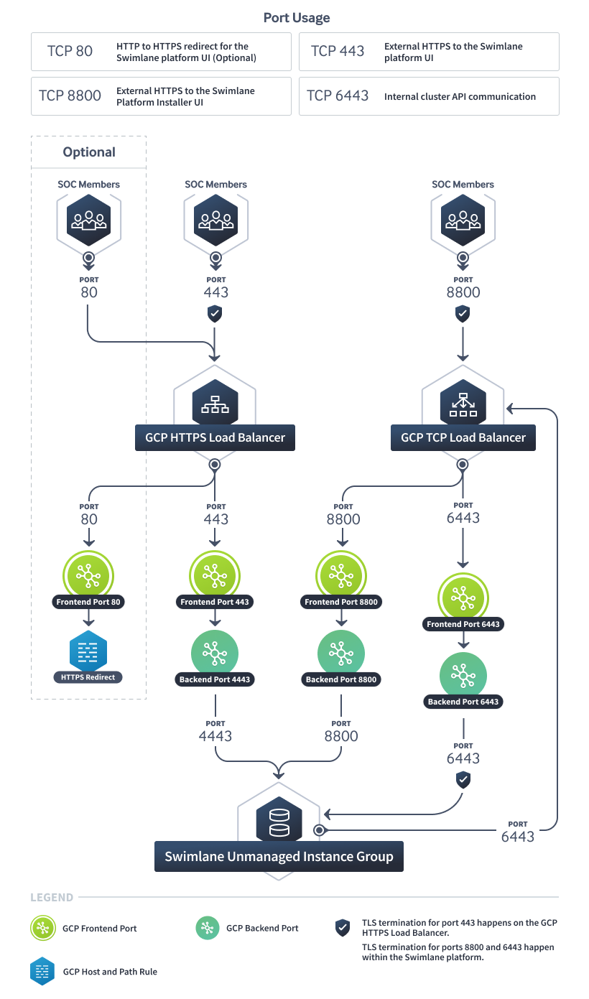

GCP HTTPS Load Balancer
=======================

This topic explains how to use an GCP HTTPS Load Balancer (Layer 7) for
your Swimlane Web UI deployment.

Architecture Diagram
--------------------

|image1|

Limitations
-----------

Due to the limit of ports that may be used with a GCP HTTPS Load
Balancer, this type of load balancer may only be used to load balance
the traffic of the Swimlane Web UI. A separate TCP load balancer must be
used to load balance the other necessary ports for the Turbine Platform
Installer(TPI) Console and Kubernetes API.

Create an Unmanaged Instance Group:
-----------------------------------

To create an `unmanaged instance
group <https://cloud.google.com/compute/docs/instance-groups?hl=en>`__:

-  Set a name for the Instance Group
-  Set the region and the zone to where the Turbine VM instances live
-  Set the ``Port name mapping`` Name to ``Turbine`` and the Port Number
   to ``4443``
-  Set the network to where the Turbine VM instances live
-  Add your first Turbine primary in the VM instances drop-down

Load Balancer for Swimlane Web UI
---------------------------------

Create an HTTPS Load Balancer:
~~~~~~~~~~~~~~~~~~~~~~~~~~~~~~

To create an `HTTPS load
balancer <https://cloud.google.com/load-balancing/docs/https>`__:

-  For ``Internet facing or internal only`` select
   ``From Internet to my VMs``

-  Backend Configuration

   -  Either select an existing backend service or select
      ``Create a Backend Service``

      -  For ``Backend Type`` select ``Instance group``
      -  For ``Protocol`` select ``HTTPS``
      -  For ``Named port`` select ``Turbine``
      -  Set a name for the Instance group and set port numbers to 4443

   -  Under the health check drop-down select an existing health check
      or ``Create another health check``

      -  Set a name for the health check
      -  Set the protocol to ``HTTPS``
      -  Set the port to ``4443``
      -  Unless needed per your organization's requirements, leave the
         defaults for the remaining settings

-  Host and Path rules may be left in the ``Simple host and path rule``
   configuration.

-  Front End Configuration

   -  Set a name for the ``New Frontend IP and Port``
   -  Set the ``Protocol`` to ``HTTPS(includes HTTP/2)``
   -  Set the ``IP address`` to an existing one or select
      ``Create IP Address``
   -  Set the ``Certificates`` to an existing one or select
      ``Create A New Certificate``
   -  Select the ``Enable HTTP to HTTPS redirect`` option to redirect
      basic HTTP (port 80) traffic to HTTPS (port 443).

Load Balancer for TPI Console Access and Internal Cluster Traffic
-----------------------------------------------------------------

Create a TCP Load Balancer:
~~~~~~~~~~~~~~~~~~~~~~~~~~~

To create a `TCP load
balancer <https://cloud.google.com/load-balancing/docs/network>`__: 

-  For Internet facing or internal only set ``From Internet to my VMs``

-  For Multiple regions or single region set ``Single region only``

-  For Backend type set ``Backend Service``

-  Create a Backend Configuration

   -  Set the region to where the Turbine instances live
   -  Select your Instance Group that contains the first Turbine TPI VM
   -  Under the health check drop-down select an existing health check
      or ``Create another health check``

      -  Set a name for the health check
      -  Set the protocol to ``TCP``
      -  Set the port to ``6443``
      -  Unless needed per your organization's requirements, leave the
         defaults for the remaining settings

-  Create a Frontend Configuration

   -  Set the Network Service Tier per your requirements

   -  Create a new reserved IP address or use an existing one

   -  Set Ports to ``Multiple``

   -  Set the port to ``6443,8800``

   -  Create the load balancer

   -  After Turbine has been installed on the additional nodes they need
      to be added to this target group.

Notes
-----

After the initial install is done, you will need to join any additional
primaries to the Turbine cluster before adding them to the Instance
Group in use by your load balancer to ensure the join script runs
successfully. If you want a multi-zonal deployment, you can create
additional Unmanaged Instance Groups and put your other Turbine
primaries in them.

Adding Backend Configuration for NodePort services
--------------------------------------------------

Due to GCP's workaround for hairpinning, traffic may blackhole when
attempting to access NodePorts through the load balancer. This is
because GCP automatically routes traffic destined for the load balancer
to the loopback address of the VM the request was forwarded to, and
kube-proxy does not listen on localhost. To workaround this and
successfully access NodePorts through the load balancer, you will need
to create an alias for the primary network interface that resolves to
the load balancer's IP address e.g.,
``ifconfig eth0:0 <lb-ip> netmask 255.255.255.255`` up on each node in
the Turbine cluster. To persist these changes you will need to add them
to your network interfaces configuration file.

Firewall Rules
--------------

For GCP Load Balancers, ingress port access is defined in the Firewall
section of your GCP Project's VPC Network. For more information about
the port requirements see `External
Access <../system-requirements-for-an-embedded-cluster-install/system-requirements-for-an-embedded-cluster-install.htm#External>`__.

Turbine Configuration
---------------------

Be sure to enable the ``Expose the Swimlane Web Service Externally``
option on the Turbine Platform Installer UI config tab.

