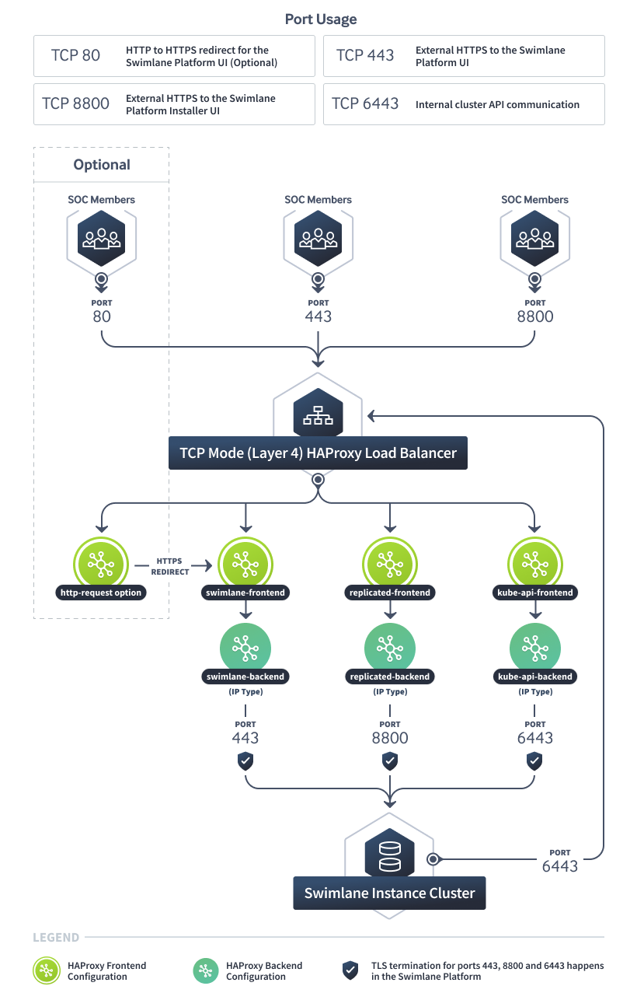
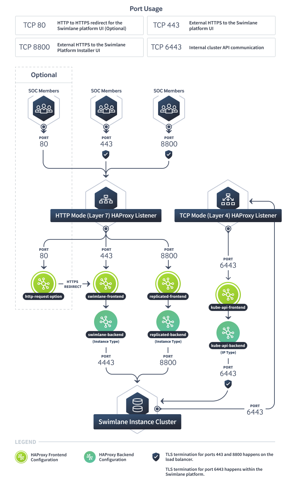

HAProxy Load Balancer
=====================

This topic explains how to use an `HAProxy Load
Balancer <http://www.haproxy.org/>`__ for your Turbine deployment.
HAProxy can be run either as a Layer 4 (TCP mode) or a Layer 7
(HTTP-mode). Currently, a Layer 7 load balancer is not supported for the
Kubernetes API. However, HAProxy works as a hybrid and provides load
balancing for both Layer 4 and Layer 7 applications using a single
daemon.

**Note:** This topic is limited to being an example of how to use
HAProxy as a load balancer for Turbine. Configuring the load balancer as
described here will result in a non-highly available configuration.
HAProxy can be configured with HA and failover capabilities using the
same example configuration, but the HA configuration of HAProxy is
beyond the scope of this topic.

**Note:** Both examples in this topic include an enabled HAProxy
statistics listener. This can be useful for keeping track of metrics and
backend node health. It is accessible over port 8080. It is in no way
required and can be disabled by deleting the ``listener stats`` sections
of the configuration.

Architecture Diagram
--------------------

TCP Mode (Layer 4) HAProxy
~~~~~~~~~~~~~~~~~~~~~~~~~~

|image1|

HTTP Mode (Layer 7) HAProxy
~~~~~~~~~~~~~~~~~~~~~~~~~~~

|image2|

Layer 4 (TCP mode) HAProxy Load Balancer
----------------------------------------

The benefits of TCP mode are in its simplicity. TCP mode simply forwards
network traffic at the port level to the configured backend servers.
This allows the backend service to control almost all aspects of the
communication. For example, TCP mode enables the backend service to
provide its own TLS certificate so that SSL doesn't get terminated at
the load balancer.

The downside of TCP mode for Turbine's use case is that generally
upgrades to the load balancer (ie: whitelisting or blacklisting SSL
ciphers) can happen much more quickly in HTTP-mode by the administrator
versus waiting for a Turbine release.

Example configuration for a Layer 4 HAProxy server:

################## # GLOBAL OPTIONS # ################## global defaults
timeout client 30s timeout server 30s timeout connect 30s listen stats
bind \*:8080 mode http stats enable stats uri / stats hide-version ## #
Turbine Frontend / Backend ## frontend turbine-frontend mode tcp bind
\*:80 # Optional https redirection bind \*:443 http-request redirect
scheme https unless { ssl_fc } # Optional https redirection
default_backend turbine-backend backend turbine-backend mode tcp balance
roundrobin option tcp-check server tpi-node-1 tpi-node-1.swimlane.io:443
check server tpi-node-2 tpi-node-2.swimlane.io:443 check server
tpi-node-3 tpi-node-3.swimlane.io:443 check ## # Turbine Platform
Installer UI Frontend / Backend ## frontend replicated-frontend mode tcp
bind \*:8800 default_backend replicated-backend backend
replicated-backend mode tcp balance roundrobin option tcp-check server
tpi-node-1 tpi-node-1.swimlane.io:8800 check server tpi-node-2
tpi-node-2.swimlane.io:8800 check server tpi-node-3
tpi-node-3.swimlane.io:8800 check ## # Kubernetes API Frontend / Backend
## frontend kube-api-frontend mode tcp bind \*:6443 default_backend
kube-api-backend backend kube-api-backend mode tcp balance roundrobin
option tcp-check server tpi-node-1 tpi-node-1.swimlane.io:6443 check
server tpi-node-2 tpi-node-2.swimlane.io:6443 check server tpi-node-3
tpi-node-3.swimlane.io:6443 check

Turbine Configuration
~~~~~~~~~~~~~~~~~~~~~

Be sure to select the ``Enable Included Ingress Controller`` option on
the Turbine Platform Installer UI config tab when using TCP mode.

Port Requirements
~~~~~~~~~~~~~~~~~

The ports to be load balanced in TCP mode are:

-  Port 443
-  Port 6443
-  Port 8800

These ports must be accessible from the load balancer to any node that
is a part of the cluster.

Layer 7 (HTTP mode) HAProxy Load Balancer
-----------------------------------------

HTTP-mode load balancers offer more flexibility and more advanced
routing capabilities over TCP mode. SSL termination occurs at the load
balancer, at which point the load balancer communicates with the backend
nodes over the HTTP protocol. Configuration of the load balancer in
HTTP-mode is more flexible and allows for a wider range of configuration
options that do not rely on a Turbine release.

Be aware that HTTP mode is incompatible with the Kubernetes API. You
will need to utilize at least one TCP-mode frontend and backend.

The example below requires an SSL certificate + a key located at
``/etc/haproxy/server.pem``.

Example configuration for a Layer 7 HAProxy server:

################## # GLOBAL OPTIONS # ################## global defaults
timeout client 30s timeout server 30s timeout connect 30s listen stats
bind \*:8080 mode http stats enable stats uri / stats hide-version ## #
Turbine Frontend / Backend ## frontend turbine-frontend mode http bind
\*:443 ssl crt /etc/haproxy/server.pem default_backend swimlane-backend
backend turbine-backend mode http balance roundrobin option tcp-check
server tpi-node-1 tpi-node-1.swimlane.io:4443 check check-ssl ssl verify
none server tpi-node-2 tpi-node-2.swimlane.io:4443 check check-ssl ssl
verify none server tpi-node-3 tpi-node-3.swimlane.io:4443 check
check-ssl ssl verify none ## # Turbine Platform Installer UI Frontend /
Backend ## frontend replicated-frontend mode http bind \*:8800 ssl crt
/etc/haproxy/server.pem default_backend replicated-backend backend
replicated-backend mode http balance roundrobin option httpchk get
/healthz server tpi-node-1 tpi-node-1.swimlane.io:8800 check check-ssl
ssl verify none server tpi-node-2 tpi-node-2.swimlane.io:8800 check
check-ssl ssl verify none server tpi-node-3 tpi-node-3.swimlane.io:8800
check check-ssl ssl verify none ## # Kubernetes API Frontend / Backend
## frontend kube-api-frontend mode tcp bind \*:6443 default_backend
kube-api-backend backend kube-api-backend mode tcp balance roundrobin
option tcp-check server tpi-node-1 tpi-node-1.swimlane.io:6443 check
server tpi-node-2 tpi-node-2.swimlane.io:6443 check server tpi-node-3
tpi-node-3.swimlane.io:6443 check

Swimlane Configuration
~~~~~~~~~~~~~~~~~~~~~~

Be sure to enable the ``Expose the Swimlane Web service externally``
option on the Turbine Platform Installer UI config tab when using
HAProxy in HTTP mode.

.. _port-requirements-1:

Port Requirements
~~~~~~~~~~~~~~~~~

The ports to be load balanced in HTTP mode are:

-  Port 4443
-  Port 6443
-  Port 8800

